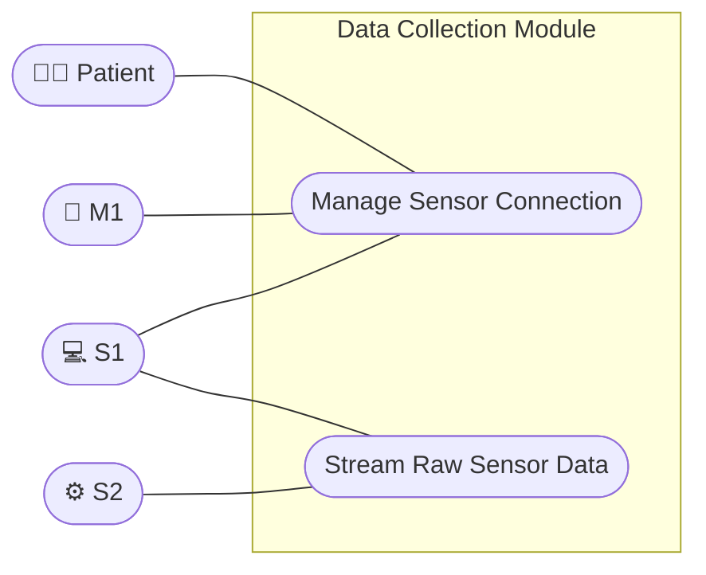
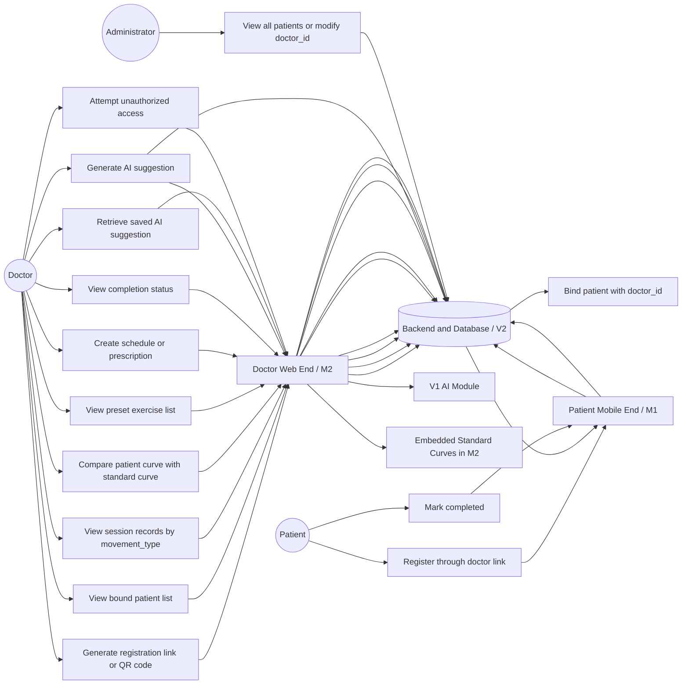

<style>
  @import url('https://fonts.googleapis.com/css2?family=Inter:wght@300;400;500;600;700;800&family=JetBrains+Mono:wght@400;500&display=swap');

  :root {
    --bg:        #0b0f1a;
    --bg2:       #0e1320;
    --bg3:       #111827;
    --card:      #141c2e;
    --card2:     #1a2236;
    --border:    rgba(255,255,255,0.07);
    --border2:   rgba(255,255,255,0.12);
    --cyan:      #38bdf8;
    --cyan-dim:  rgba(56,189,248,0.15);
    --green:     #34d399;
    --green-dim: rgba(52,211,153,0.12);
    --blue:      #60a5fa;
    --blue-dim:  rgba(96,165,250,0.08);
    --orange:    #fb923c;
    --orange-dim:rgba(251,146,60,0.08);
    --amber:     #fbbf24;
    --amber-dim: rgba(251,191,36,0.08);
    --red:       #f87171;
    --red-dim:   rgba(248,113,113,0.08);
    --text:      #e2e8f0;
    --text-dim:  #94a3b8;
    --text-xs:   #475569;
    --font:      'Inter', -apple-system, sans-serif;
    --mono:      'JetBrains Mono', 'Fira Code', monospace;
  }

  body, .markdown-body {
    background: var(--bg) !important;
    color: var(--text) !important;
    font-family: var(--font) !important;
    line-height: 1.7;
  }

  .doc-header {
    background: var(--bg);
    padding: 0 0 1.5rem 0;
    margin-bottom: 1.5rem;
    position: relative;
    overflow: hidden;
  }
  .doc-header::before {
    content: '';
    position: absolute;
    inset: 0;
    background: radial-gradient(ellipse 70% 60% at 80% 50%, rgba(56,189,248,0.04) 0%, transparent 70%);
    pointer-events: none;
  }
  .doc-header-tag {
    font-size: 0.62rem;
    font-weight: 700;
    letter-spacing: 0.16em;
    text-transform: uppercase;
    color: var(--bg);
    background: #94a3b8;
    padding: 0.2rem 0.6rem;
    border-radius: 4px;
    margin-bottom: 0.6rem;
    display: inline-block;
  }
  .doc-header h1 {
    font-size: clamp(1.6rem, 3.5vw, 2.2rem);
    font-weight: 800;
    letter-spacing: -0.03em;
    color: var(--text);
    margin: 0 0 0.5rem;
    line-height: 1.1;
  }
  .doc-header h1 span { color: var(--cyan); }
  .doc-header-meta {
    display: flex;
    flex-wrap: wrap;
    gap: 0.6rem;
    margin-top: 1.2rem;
  }
  .meta-chip {
    font-size: 0.72rem;
    font-weight: 500;
    color: var(--text-dim);
    background: rgba(255,255,255,0.04);
    border: 1px solid var(--border2);
    border-radius: 999px;
    padding: 0.25rem 0.8rem;
    letter-spacing: 0.02em;
  }
  .meta-chip strong { color: var(--text); }

  .section-label {
    font-size: 0.62rem;
    font-weight: 700;
    letter-spacing: 0.16em;
    text-transform: uppercase;
    color: var(--cyan);
    margin-bottom: 0.5rem;
    display: block;
  }

  .m1-card {
    background: var(--card);
    border: 1px solid var(--border);
    border-radius: 12px;
    padding: 1.5rem;
    margin: 1rem 0;
  }

  .info-block {
    border-left: 3px solid var(--cyan);
    background: var(--card);
    border-radius: 0 10px 10px 0;
    padding: 1rem 1.25rem;
    margin: 1rem 0;
    font-size: 0.85rem;
    color: var(--text-dim);
    line-height: 1.6;
  }
  .info-block.warn { border-left-color: var(--amber); }
  .info-block strong { color: var(--text); }

  .section-divider {
    border: none;
    border-top: 1px solid var(--border);
    margin: 2.5rem 0;
  }

  .badge {
    display: inline-flex;
    align-items: center;
    gap: 0.2rem;
    font-size: 0.65rem;
    font-weight: 700;
    letter-spacing: 0.08em;
    text-transform: uppercase;
    padding: 0.2rem 0.6rem;
    border-radius: 5px;
    border: 1px solid;
    white-space: nowrap;
  }
  .badge-cyan    { color: var(--cyan);   border-color: rgba(56,189,248,0.4);  background: rgba(56,189,248,0.1); }
  .badge-green   { color: var(--green);  border-color: rgba(52,211,153,0.4);  background: rgba(52,211,153,0.1); }
  .badge-blue    { color: var(--blue);   border-color: rgba(96,165,250,0.4);  background: rgba(96,165,250,0.1); }
  .badge-orange  { color: var(--orange); border-color: rgba(251,146,60,0.4);  background: rgba(251,146,60,0.1); }
  .badge-amber   { color: var(--amber);  border-color: rgba(251,191,36,0.4);  background: rgba(251,191,36,0.1); }
  .badge-red     { color: var(--red);    border-color: rgba(248,113,113,0.4); background: rgba(248,113,113,0.1); }
  .badge-dim     { color: var(--text-dim); border-color: var(--border2); background: transparent; }

  h1, h2, h3, h4, h5, h6 {
    color: var(--text);
    font-weight: 700;
    letter-spacing: -0.02em;
    border-color: var(--border);
  }
  h1 { font-size: 1.5rem; margin-top: 1.5rem; }
  h2 {
    font-size: 1.3rem;
    margin-top: 2.5rem;
    padding-bottom: 0.5rem;
    border-bottom: 1px solid var(--border);
    color: var(--cyan);
  }
  h3 {
    font-size: 1.05rem;
    margin-top: 2rem;
    color: var(--text);
  }
  h4 {
    font-size: 0.95rem;
    margin-top: 1.5rem;
    color: var(--text-dim);
  }

  p {
    color: var(--text-dim);
    line-height: 1.7;
  }
  p strong { color: var(--text); }

  a {
    color: var(--cyan);
    text-decoration: none;
    border-bottom: 1px solid transparent;
    transition: border-color 0.2s;
  }
  a:hover {
    border-bottom-color: var(--cyan);
  }

  ul, ol {
    color: var(--text-dim);
    padding-left: 1.5rem;
  }
  li {
    margin: 0.35rem 0;
  }
  li::marker {
    color: var(--cyan);
  }

  hr {
    border: none;
    border-top: 1px solid var(--border);
    margin: 2.5rem 0;
  }

  blockquote {
    border-left: 3px solid var(--orange);
    background: var(--card);
    border-radius: 0 10px 10px 0;
    padding: 0.75rem 1.25rem;
    margin: 1rem 0;
    color: var(--text-dim);
  }
  blockquote p { margin: 0; }
  blockquote strong { color: var(--text); }

  table {
    width: 100%;
    border-collapse: separate;
    border-spacing: 0;
    font-size: 0.875rem;
    font-family: var(--font);
    border: 1px solid var(--border);
    border-radius: 12px;
    overflow: hidden;
    margin: 1.2rem 0;
    display: table;
  }
  thead {
    background: var(--card2);
  }
  th {
    font-size: 0.63rem;
    font-weight: 700;
    letter-spacing: 0.12em;
    text-transform: uppercase;
    color: var(--cyan);
    padding: 0.85rem 1.25rem;
    text-align: left;
    border-bottom: 1px solid var(--border);
    white-space: nowrap;
  }
  td {
    padding: 0.9rem 1.25rem;
    border-bottom: 1px solid var(--border);
    color: var(--text-dim);
    vertical-align: middle;
  }
  tbody tr:last-child td { border-bottom: none; }
  tbody tr { transition: background 0.18s; }
  tbody tr:hover td { background: rgba(56,189,248,0.03); }
  td strong { color: var(--text); }
  td code {
    font-family: var(--mono);
    font-size: 0.78rem;
    background: rgba(56,189,248,0.08);
    color: var(--cyan);
    padding: 0.1rem 0.4rem;
    border-radius: 4px;
  }

  pre {
    background: var(--bg2) !important;
    border: 1px solid var(--border) !important;
    border-radius: 12px !important;
    padding: 1.25rem !important;
    overflow-x: auto;
    margin: 1.2rem 0;
  }
  pre code {
    font-family: var(--mono) !important;
    font-size: 0.82rem !important;
    line-height: 1.6 !important;
    color: var(--text) !important;
    background: transparent !important;
    padding: 0 !important;
    border-radius: 0 !important;
  }
  code {
    font-family: var(--mono) !important;
    font-size: 0.82rem;
    background: rgba(56,189,248,0.08);
    color: var(--cyan);
    padding: 0.15rem 0.35rem;
    border-radius: 4px;
  }

  p code, li code {
    font-size: 0.78rem;
    padding: 0.1rem 0.35rem;
  }

  thead tr:first-child th:first-child { border-top-left-radius: 11px; }
  thead tr:first-child th:last-child  { border-top-right-radius: 11px; }
  tbody tr:last-child td:first-child { border-bottom-left-radius: 11px; }
  tbody tr:last-child td:last-child  { border-bottom-right-radius: 11px; }
</style>

# Software Requirements Analysis —— Limb Motion Recognition and Assistant v2.0

---

## Contents

- [Part 1 Introduction](#part-1-introduction)
  - [1. Revision History](#1-revision-history)
  - [2. Scope](#2-scope)
    - [M1 — Patient Mobile Application](#p1-scope-m1)
    - [M2 — Doctor & Admin Module](#p1-scope-m2)
    - [S1 — Data Collection Module](#p1-scope-s1)
    - [S2 — Data Processing Module](#p1-scope-s2)
    - [V2 — Backend API & Storage](#p1-scope-v2)
    - [V1 — AI & Motion Recognition](#p1-scope-v1)
  - [3. Glossary](#3-glossary)
  - [4. References](#4-references)
- [Part 2 External Use Cases](#part-2-external-use-cases)
  - [M1 — Patient Mobile Application](#p2-m1)
    - [1. Actor Table](#p2-m1-actor)
    - [2. Use Case Table](#p2-m1-uc-table)
    - [3. Detailed Use Cases](#p2-m1-uc-detail)
  - [M2 — Doctor & Admin Module](#p2-m2)
  - [S1 — Data Collection Module](#p2-s1)
  - [S2 — Data Processing Module](#p2-s2)
- [Part 3 Internal Use Cases](#part-3-internal-use-cases)
  - [M1 — Patient Mobile Application](#p3-m1)
    - [1. Actor Table](#p3-m1-actor)
    - [2. Use Case Table](#p3-m1-uc-table)
    - [3. Detailed Use Cases](#p3-m1-uc-detail)
  - [M2 — Doctor & Admin Module](#p3-m2)
    - [1. Actor Table](#p3-m2-actor)
    - [2. Use Case Table](#p3-m2-uc-table)
    - [3. Detailed Use Cases](#p3-m2-uc-detail)
  - [S1 — Data Collection Module](#p3-s1)
    - [1. Actor Table](#p3-s1-actor)
    - [2. Use Case Table](#p3-s1-uc-table)
    - [3. Detailed Use Cases](#p3-s1-uc-detail)
  - [S2 — Data Processing Module](#p3-s2)
    - [1. Actor Table](#p3-s2-actor)
    - [2. Use Case Table](#p3-s2-uc-table)
    - [3. Detailed Use Cases](#p3-s2-uc-detail)
  - [V2 — Backend API & Storage](#p3-v2)
  - [V1 — AI & Motion Recognition](#p3-v1)
- [Part 4 Others](#part-4-others)
  - [1. Assumptions and Dependencies](#p4-assumptions)
    - [1.1 M1 — Patient Mobile Application](#p4-assumptions-m1)
    - [1.2 S1 — Data Collection Module](#p4-assumptions-s1)
    - [1.3 V2 — Backend API & Storage](#p4-assumptions-v2)
    - [1.4 V1 — AI & Motion Recognition](#p4-assumptions-v1)
    - [1.5 M2 — Doctor & Admin Module](#p4-assumptions-m2)
  - [2. Non-functional Requirements](#p4-nfr)
    - [2.1 M1 — Patient Mobile Application](#p4-nfr-m1)
    - [2.2 V2 — Backend API & Storage](#p4-nfr-v2)
    - [2.3 V1 — AI & Motion Recognition](#p4-nfr-v1)
    - [2.4 M2 — Doctor & Admin Module](#p4-nfr-m2)
  - [3. Open Items](#p4-open)
    - [3.1 M1 — Patient Mobile Application](#p4-open-m1)
    - [3.2 M2 — Doctor & Admin Module](#p4-open-m2)
    - [3.3 V1 — AI & Motion Recognition](#p4-open-v1)
    - [3.4 V2 — Backend API & Storage](#p4-open-v2)
  - [4. Internal Use Case Diagram](#p4-diagram)
    - [4.1 S1 — Data Collection Module](#p4-diagram-s1)
    - [4.2 M2 — Doctor & Admin Module](#p4-diagram-m2)
  - [5. V2 — Interface and Data Exchange Summary](#p4-v2-interface)
  - [6. V1 — Phase II Direction and Analysis](#p4-v1-phase2)
  - [7. M2 — Functional Requirements Summary](#p4-m2-fr)
  - [8. M2 — Data and Interface Requirements](#p4-m2-data)
  - [9. M2 — Acceptance Criteria and Implementation Priority](#p4-m2-ac)

---

## Part 1 Introduction

### 1. Revision History

| Date | Author | Description |
| :--- | :--- | :--- |
| Jun 8, 2026 | WangYiding | Preliminary integration of Phase II requirements analysis documents from all six teams (M1, M2, S1, S2, V1, V2). |

### 2. Scope

#### M1 — Patient Mobile Application {#p1-scope-m1}

This document defines the software requirements for the M1 Patient Mobile Application, a component of the Limb Motion Recognition and Assistant system developed under the DSD 2025–2026 programme (UTAD × Jilin University).

The M1 application serves as the primary interface for patients. It covers the following functional areas:

- **Account Management:** Register, log in, sign out, and bind a doctor.
- **Rehabilitation Training:** Connect to sensors, start and end training exercises, and receive real-time motion feedback.
- **History & Evaluation:** Browse, refresh, and delete local historical records, and view AI-generated training evaluations.
- **Schedule:** View the assigned rehabilitation schedule, view schedule details including demo video, and mark schedules as completed.
- **Notifications:** Register with a push notification service and receive push messages.

Internal interactions with the Sensor subsystem (S1, S2), Backend Server (V2), and Push Service are detailed in the Internal Use Cases (Part 3).

The following are out of scope for M1:
- Doctor-facing or administrator-facing interfaces (handled by other modules/groups).
- Sensor hardware design and firmware logic.
- Server-side AI model training and data persistence implementation details.
- Third-party push notification service vendor selection and configuration.

#### M2 — Doctor & Admin Module {#p1-scope-m2}

This document covers the M2 (Doctor Module + Admin Module) of the web-based motion analysis and health recommendation platform. M2 is responsible for providing interfaces for two types of users:

**Doctor Functions:**
- Manage personal account (registration, login, password reset) with admin approval for registration.
- View and manage the list of assigned patients.
- Visualize patient knee joint motion data (extension and flexion angles) with left/right leg toggling and date range selection.
- Write rehabilitation suggestions using preset exercise buttons and free-text notes, and manage existing suggestions.

**Admin Functions:**
- Login/logout to the system.
- Review doctor registration applications and verify submitted licenses.
- Manage doctor accounts (enable/disable/delete).
- Manage patient accounts.
- View health data reports and system statistics.
- Handle user feedback.
- Manage platform content (e.g., announcements).
- Role and permission management.
- Audit admin action logs.
- Manage system notifications (automatic and manual).

The system as a whole receives sensor data, conducts motion analysis, and provides health recommendations. Doctors interact with the platform to deliver professional rehabilitation guidance to patients, while administrators are responsible for platform operations and maintenance.

#### S1 — Data Collection Module {#p1-scope-s1}

This document defines the software requirements for the S1 Data Collection module, a component of the Limb Motion Recognition and Assistant system developed under the DSD 2025–2026 programme (UTAD × Jilin University).

The S1 module manages sensor connectivity, acquires raw sensor telemetry, and structures the output for subsequent processing by S2. It encompasses the following functional requirements:

- **Sensor Connection Management:** Process connection requests from M1 and establish secure communication links with designated sensors.
- **Connection Status Monitoring:** Continuously poll the connectivity state of active sensors and report hardware exceptions or disconnections in real-time.
- **Data Acquisition:** Retrieve raw telemetry data from connected sensors and stream the payloads to S2.

Internal interactions with the Sensor subsystem (S2) and the Mobile Application (M1) are detailed in the Internal Use Cases (Part 3).

The following are out of scope for S1:
- Data processing (handled by S2).
- User-facing interfaces and rehabilitation workflow (handled by M1).
- Server-side data persistence, AI model training, and recommendation engine (handled by V2 and V1).

#### S2 — Data Processing Module {#p1-scope-s2}

None.

#### V2 — Backend API & Storage {#p1-scope-v2}

V2 — Backend API & Storage is the central server-side component of the Limb Motion Recognition and Assistant system. It is implemented as a Node.js + Express REST API backed by a SQLite database (sql.js). V2 is the single integration point for all other subsystems: it receives sensor measurement data from S2, serves session and measurement data to M1 and M2, provides AI classification inputs to V1, and manages all persistent storage for the platform.

V2 does not have a direct user-facing interface. It provides the following services to other groups:

- User registration, authentication (JWT), and clinician approval workflow
- Session lifecycle management (create, close)
- Measurement ingestion (single and batch) and retrieval with date-range filtering
- Patient list and profile access for the doctor dashboard
- Rehabilitation recommendation management (create, read, update, delete)
- Rehabilitation schedule storage and retrieval
- Push notification token registration and dispatch

The following are out of scope for V2: sensor hardware and firmware (S1), raw sensor data acquisition and mock generation (S2), patient mobile application UI (M1), doctor web dashboard UI (M2), and AI motion classification model training (V1).

#### V1 — AI & Motion Recognition {#p1-scope-v1}

V1 — AI & Motion Recognition is the server-side AI analysis component of the Limb Motion Recognition and Assistant system. It is responsible for reading motion session measurements from V2, analysing the available angle values, and providing AI-generated recommendation results back to V2.

For the current Generation 1 implementation, the patient uploads two angle values. These values are handled through the current V2 `jointAngles` format. V1 uses these two angles to create a plain-text recommendation. The doctor may also provide plain-text recommendation information. V1 output should therefore be treated as AI-assisted support information, not as a final clinical decision.

For a future generation, Team V1 expects the interface to evolve toward a richer format aligned with the integrated system documentation, using `targetAngles`, `sensorData`, and `errors`. This future format will be needed for a more complete AI-based motion recognition pipeline using raw IMU-style data.


### 3. Glossary

| Term | Definition | Abbreviation/Alias | Remarks |
| :--- | :--- | :--- | :--- |
| Raw Sensor Data | Sensor data collected by S1. | | The data collected by S1. |
| Formal Sensor Data | Sensor data processed by S2. | | The data collected by S1 is called raw sensor data, and S2 processes the raw sensor data to obtain the Formal sensor data. |
| Connection Status | Whether the sensor is connected or disconnected with the device. | | Tells patient whether the sensor has successfully connected with the device. There are only 2 status, connected and disconnected. |
| Rehabilitation Session | A discrete period of training during which sensor data is actively collected, processed, and streamed. | Session / Exercise | Core unit of a patient's training activity. |
| Rehabilitation Session Meta Data | Meta information determined and fixed at the start of a session, including the rehabilitation training category, etc. | Session Meta Data | Key information of a session. |
| Real-Time Motion Feedback | Immediate visual, auditory, or textual guidance provided to the patient based on ongoing motion analysis. | Feedback | Key feature during an active session. |
| AI Evaluation | A report automatically generated by the server-side AI summarizing the patient's performance in recent sessions. | AI Summary | Accessed via the history page. |
| Token | A digital credential returned by V2 upon successful authentication, used by M1 to maintain the patient's logged-in state. | Login Token | Used in Register and Log In use cases. |
| Session | A bounded rehabilitation exercise event with a started_at timestamp and an optional ended_at. Measurements may only be added to an open (not ended) session. | | Core unit of a patient's training activity in V2. |
| Measurement | A single joint-angle reading associated with a session. Contains joint_angles (JSON object), is_correct (boolean, set by V1), and an ISO 8601 timestamp. | | Stored by V2 and retrieved by M1, M2, and V1. |
| Pending | Clinician account status after self-registration, before admin approval. A pending account cannot log in. | | Set by V2 during clinician registration. |
| Active | Fully operational user account status. Required for login. | | Set by V2 after admin approves clinician registration. |
| JWT | JSON Web Token — stateless bearer token issued by V2 on successful login, required on all protected endpoints. | Bearer Token | Authentication mechanism used throughout V2. |
| ISO 8601 | Timestamp format used throughout V2: YYYY-MM-DDTHH:MM:SS.sssZ. All date fields normalised on every database read. | ISO Timestamp | Standard timestamp format exchanged between all subsystems. |
| AI Motion Analysis | The process of analysing uploaded angle values or sensor data to produce recommendations or classification results. | V1 Analysis | Performed by Team V1 server-side. |
| Generation 1 | The first integrated version of V1 using the current V2 API with two angle values inside `jointAngles` and plain-text recommendation output. | Gen 1 | Current implementation scope for V1. |
| Future Generation | A planned extension of V1 using richer `targetAngles + sensorData + errors` format for full IMU-based motion recognition. | Future Gen | Planned but not a dependency for the first presentation. |
| Plain-Text Recommendation | The main V1 output for Generation 1: a human-readable recommendation or analysis result sent to V2 via `POST /recommendations`. | Recommendation | AI-assisted support information, not a final clinical decision. |
| Confidence | A score between 0.0 and 1.0 indicating how confident V1 is about its analysis result. | Confidence Score | Included in V1 output when supported by V2 schema. |
| Doctor ID | `doctor_id` | The identifier of the doctor who owns or manages a patient. | |
| Patient ID | `user_id` or `patient_id` | The identifier of the patient. | |
| Rehabilitation exercise ID | `exercise_id` | The identifier of a preset rehabilitation exercise used in schedules or prescriptions. | |
| Measured movement type | `movement_type` | The movement actually measured in a session, such as `walking`, `stair_climbing`, or `squatting`. | |
| Plan / Schedule | A scheduled exercise appointment for a patient. | | |
| Plan exercise | An individual exercise inside a plan (sets/reps/hold). | | |


### 4. References

| No. | Document Name | Source/Author | Description |
| :--- | :--- | :--- | :--- |
| 1 | 2026-06-02-M1_SRS_v2.0.md | M1 Team | M1 Patient Mobile Application Software Requirements Analysis v2.0 |
| 2 | m2-srs-phase-ii-doctor-web-end.md | M2 Team | M2 Doctor Web End Phase II Software Requirements Specification |
| 3 | 0427srs.md | S1 Team | S1 Data Collection Module Software Requirements Specification |
| 4 | srs-round-2.md | S2 Team | S2 Data Processing Module Software Requirements Analysis (Round 2) |
| 5 | IF2-InterfaceSpecification(1).md | V2 Team | V2 Backend API & Storage IF2 Interface Specification v2.1 |
| 6 | v1_phase2_requirements_analysis.md | V1 Team | V1 AI & Motion Recognition Phase II Requirements Analysis |

---

## Part 2 External Use Cases

### M1 — Patient Mobile Application {#p2-m1}

#### 1. Actor Table {#p2-m1-actor}

| Actor | Description |
| :--- | :--- |
| Patient | Rehabilitation end-user who performs exercises and views progress via the app. |
| System | The whole project, including mobile app, sensors, and server. |

#### 2. Use Case Table {#p2-m1-uc-table}

| Use Case ID | Use Case Name | Primary Actor | Brief Description |
| :--- | :--- | :--- | :--- |
| UC-M1-01-01 | Register | Patient | Patient creates a new account, binds a doctor, and is automatically logged in. |
| UC-M1-01-02 | Log In | Patient | Patient logs into an existing account. |
| UC-M1-01-03 | Sign Out | Patient | Patient logs out of the current account. |
| UC-M1-02-01 | Connect Sensor | Patient | Patient connects or disconnects a rehabilitation sensor. |
| UC-M1-02-02 | Start Rehabilitation Exercise | Patient | Patient starts a new rehabilitation training exercise. |
| UC-M1-02-03 | Real-Time Motion Feedback | Patient | System gives real-time feedback based on sensor data during training. |
| UC-M1-02-04 | End Rehabilitation Exercise | Patient | Patient ends the current exercise and views a summary. |
| UC-M1-03-01 | Refresh Historical Records | Patient | Patient syncs the latest exercise history from the server. |
| UC-M1-03-02 | Delete Historical Records | Patient | Patient removes one or more past exercise records. |
| UC-M1-03-03 | Browse Local Historical Records | Patient | Patient browses past exercise records and their details. |
| UC-M1-03-04 | View AI Evaluations About Recent Training | Patient | Patient views AI-generated evaluation reports for recent exercises. |
| UC-M1-04-01 | View Rehabilitation Schedule | Patient | Patient views the assigned rehabilitation schedule. |
| UC-M1-04-02 | View Schedule Detail with Video | Patient | Patient views plan details including description and demo video. |
| UC-M1-04-03 | Mark Schedule as Completed | Patient | Patient confirms completion of a schedule item. |
| UC-M1-05-01 | Receive Push Notifications | Patient | Patient receives a push notification message on the device. |
| UC-M1-06-01 | Doctor Rebinding in Settings | Patient | Patient changes bound doctor via Profile Settings. |

#### 3. Detailed Use Cases {#p2-m1-uc-detail}

##### UC-M1-01-01 Register

| Element | Description |
| :--- | :--- |
| **Reference** | UC-M1-01-01 |
| **Actors** | Patient, System |
| **Goal** | Allow a patient to create an account and bind a doctor. |
| **Summary** | Patient fills in registration information and doctorId; system verifies the doctor, creates the account, binds the doctor, and logs the patient in. |
| **Trigger** | Patient opens the account creation page. |
| **Precondition** | None |
| **Postconditions** | Patient is automatically logged in, the doctor is bound if verification succeeds, and the patient is redirected to the main page. |

**Basic Flow**

| Step | Actor Action | System Response |
| :--- | :--- | :--- |
| 1 | Patient enters registration information (name, email, password, doctorId) and clicks "Verify Doctor". | |
| 2 | | System verifies the doctorId with the server. |
| 3 | | System displays a confirmation dialog with the doctor's name, role, and id. |
| 4 | Patient confirms the doctor and clicks "Register". | |
| 5 | | System validates the input. If valid, creates the account and logs the patient in. |
| 6 | | System binds the doctor to the patient account. |
| 7 | | System redirects the patient to the main page. |
| 8 | Patient views the main page. | |

**Alternative Flow**

| Occurrence Step | Condition | System Response |
| :--- | :--- | :--- |
| 2 | doctorId field is empty or invalid format. | System disables "Register" button and shows an inline error. |
| 2 | System cannot reach the server. | System shows a connection error message and advises checking the network. |
| 2 | Server returns 404 or role is not "clinician". | System shows "Invalid doctor ID" error and clears the verification state. |
| 3 | Patient cancels the confirmation dialog. | System closes the dialog, keeps the doctorId field, and allows re-verification. |
| 5 | Input data does not meet requirements. | System highlights the invalid fields and asks the patient to correct them. |
| 5 | Server rejects the registration (e.g., duplicate account). | System shows a failure message with the reason. |
| 6 | Doctor binding fails (network or server error). | System shows a message: "Binding failed. Please bind manually in Settings." |

---

##### UC-M1-01-02 Log In

| Element | Description |
| :--- | :--- |
| **Reference** | UC-M1-01-02 |
| **Actors** | Patient, System |
| **Goal** | Allow a patient to log into an existing account. |
| **Summary** | Patient provides credentials; system authenticates and opens the main page. |
| **Trigger** | Patient opens the login page. |
| **Precondition** | None |
| **Postconditions** | Patient is logged in and sees the main page. |

**Basic Flow**

| Step | Actor Action | System Response |
| :--- | :--- | :--- |
| 1 | Patient enters account information and clicks "Log In". | |
| 2 | | System verifies the credentials. If correct, logs the patient in. |
| 3 | | System redirects the patient to the main page. |
| 4 | Patient views the main page. | |

**Alternative Flow**

| Occurrence Step | Condition | System Response |
| :--- | :--- | :--- |
| 2 | System cannot connect to the server. | System shows a connection error and advises checking the network. |
| 2 | Credentials are incorrect. | System displays a login failure message with the reason. |

---

##### UC-M1-01-03 Sign Out

| Element | Description |
| :--- | :--- |
| **Reference** | UC-M1-01-03 |
| **Actors** | Patient, System |
| **Goal** | Allow the patient to log out of the current account. |
| **Summary** | Patient requests to sign out; system clears the exercise records and returns to the login page. |
| **Trigger** | Patient clicks "Sign Out". |
| **Precondition** | Patient is logged in. |
| **Postconditions** | Patient is logged out and the login page is shown. |

**Basic Flow**

| Step | Actor Action | System Response |
| :--- | :--- | :--- |
| 1 | Patient clicks "Sign Out". | |
| 2 | | System logs the patient out and clears exercise data. |
| 3 | | System displays the login page. |

**Alternative Flow**

None.

---

##### UC-M1-02-01 Connect Sensor

| Element | Description |
| :--- | :--- |
| **Reference** | UC-M1-02-01 |
| **Actors** | Patient, System |
| **Goal** | Allow the patient to connect or disconnect a rehabilitation sensor. |
| **Summary** | System searches for nearby sensors and lets the patient connect or disconnect a selected one. |
| **Trigger** | Patient clicks "Connect Sensor" on the rehabilitation page. |
| **Precondition** | The patient has powered on the sensor. |
| **Postconditions** | The chosen sensor is connected or disconnected, and the application returns to the rehabilitation page. |

**Basic Flow**

| Step | Actor Action | System Response |
| :--- | :--- | :--- |
| 1 | Patient clicks "Connect Sensor". | |
| 2 | | System scans for available sensors and shows the list. |
| 3 | Patient selects a sensor from the list. | |
| 4 | | System shows "Connect" or "Disconnect" button for the selected sensor. |
| 5 | Patient clicks "Connect" or "Disconnect". | |
| 6 | | System performs the connection or disconnection. |
| 7 | | System updates the sensor list. |
| 8 | Patient clicks "Exit". | |
| 9 | | System returns to the rehabilitation page. |

**Alternative Flow**

| Occurrence Step | Condition | System Response |
| :--- | :--- | :--- |
| 6 | Connection or disconnection takes a long time. | System shows a loading indicator and disables further list changes, but allows the patient to exit. |
| 7 | After the list updates, the patient does not want to exit. | The flow returns to step 2 so the patient can select another sensor. |

---

##### UC-M1-02-02 Start Rehabilitation Exercise

| Element | Description |
| :--- | :--- |
| **Reference** | UC-M1-02-02 |
| **Actors** | Patient, System |
| **Goal** | Allow the patient to begin a rehabilitation training exercise. |
| **Summary** | Patient starts a exercise; system prepares sensor data collection and confirms the exercise. |
| **Trigger** | Patient clicks "Start Rehabilitation exercise" on the rehabilitation page. |
| **Precondition** | Patient is logged in. |
| **Postconditions** | A new rehabilitation exercise is active and training begins. |

**Basic Flow**

| Step | Actor Action | System Response |
| :--- | :--- | :--- |
| 1 | Patient clicks "Start Rehabilitation exercise". | |
| 2 | | System creates the exercise and confirms it. |
| 3 | | System begins receiving and processing sensor data. |

**Alternative Flow**

| Occurrence Step | Condition | System Response |
| :--- | :--- | :--- |
| 2 | exercise creation fails (e.g., server error). | System shows an error message and the exercise does not start. |

---

##### UC-M1-02-03 Real-Time Motion Feedback

| Element | Description |
| :--- | :--- |
| **Reference** | UC-M1-02-03 |
| **Actors** | Patient, System |
| **Goal** | Provide real-time guidance to the patient during exercises. |
| **Summary** | During a exercise, the system analyses sensor motion and gives immediate visual or audio feedback. |
| **Trigger** | Rehabilitation exercise is active; feedback is given periodically. |
| **Precondition** | A rehabilitation exercise is in progress. |
| **Postconditions** | Patient adjusts movements based on the feedback. |

**Basic Flow**

| Step | Actor Action | System Response |
| :--- | :--- | :--- |
| 1 | | System collects and processes motion data from sensors. |
| 2 | | System shows real-time feedback (e.g., text, graphic, sound) to the patient. |
| 3 | Patient receives the feedback and adjusts movements. | |

**Alternative Flow**

| Occurrence Step | Condition | System Response |
| :--- | :--- | :--- |
| 1 | Sensor data cannot be obtained or processed. | System may skip this feedback cycle or show an error indicator. |

---

##### UC-M1-02-04 End Rehabilitation Exercise

| Element | Description |
| :--- | :--- |
| **Reference** | UC-M1-02-04 |
| **Actors** | Patient, System |
| **Goal** | Allow the patient to stop the current exercise and review a summary. |
| **Summary** | Patient ends the exercise; system stops data collection and displays a exercise summary. |
| **Trigger** | Patient clicks "End Exercise". |
| **Precondition** | A rehabilitation exercise is in progress. |
| **Postconditions** | The exercise is ended, and a summary is shown. |

**Basic Flow**

| Step | Actor Action | System Response |
| :--- | :--- | :--- |
| 1 | Patient clicks "End Rehabilitation Exercise". | |
| 2 | | System stops sensor data collection and closes the exercise. |
| 3 | | System generates and displays a exercise summary. |
| 4 | Patient views the summary. | |

**Alternative Flow**

| Occurrence Step | Condition | System Response |
| :--- | :--- | :--- |
| 3 | Summary cannot be generated immediately. | System shows an error and recommends viewing the summary later in the rehabilitation history. |

---

##### UC-M1-03-01 Refresh Historical Records

| Element | Description |
| :--- | :--- |
| **Reference** | UC-M1-03-01 |
| **Actors** | Patient, System |
| **Goal** | Allow the patient to update the local exercise history from the server. |
| **Summary** | Patient requests a refresh; system fetches missing records and updates the history view. |
| **Trigger** | Patient clicks "Refresh History" on the rehabilitation history page. |
| **Precondition** | Patient is logged in and on the "View Rehabilitation History" page. |
| **Postconditions** | The exercise history is up-to-date with the latest records from the server. |

**Basic Flow**

| Step | Actor Action | System Response |
| :--- | :--- | :--- |
| 1 | Patient clicks "Refresh History". | |
| 2 | | System retrieves the most recent exercise list from the server. |
| 3 | | System identifies any exercises not yet stored locally and downloads them. |
| 4 | | System updates the displayed history list. |
| 5 | Patient views the updated history. | |

**Alternative Flow**

| Occurrence Step | Condition | System Response |
| :--- | :--- | :--- |
| 2 | Network connection is unavailable. | System alerts the patient about the network problem and stops. |
| 2 | Server returns an error. | System displays a system error message and suggests contacting the doctor. |

---

##### UC-M1-03-02 Delete Local Historical Records

| Element | Description |
| :--- | :--- |
| **Reference** | UC-M1-03-02 |
| **Actors** | Patient, System |
| **Goal** | Allow the patient to remove unwanted Local exercise records. |
| **Summary** | Patient selects one or more records and deletes them; system removes them permanently. |
| **Trigger** | Patient initiates deletion on a record in the rehabilitation history. |
| **Precondition** | Patient is logged in and viewing the rehabilitation history. |
| **Postconditions** | The selected records are deleted from the device and server. |

**Basic Flow**

| Step | Actor Action | System Response |
| :--- | :--- | :--- |
| 1 | Patient selects one or more exercise records and chooses "Delete". | |
| 2 | | System asks for confirmation. |
| 3 | Patient confirms the deletion. | |
| 4 | | System removes the records and refreshes the history list. |

**Alternative Flow**

| Occurrence Step | Condition | System Response |
| :--- | :--- | :--- |
| 3 | Patient cancels the confirmation. | System does not delete and returns to the history list. |

---

##### UC-M1-03-03 Browse Historical Records

| Element | Description |
| :--- | :--- |
| **Reference** | UC-M1-03-03 |
| **Actors** | Patient, System |
| **Goal** | Allow the patient to view details of past training exercises. |
| **Summary** | Patient browses the history list and selects a record to see its detailed data. |
| **Trigger** | Patient enters the rehabilitation history page or selects a record. |
| **Precondition** | Patient is logged in. |
| **Postconditions** | Detailed information of a selected exercise is displayed. |

**Basic Flow**

| Step | Actor Action | System Response |
| :--- | :--- | :--- |
| 1 | Patient navigates to the rehabilitation history page. | |
| 2 | | System shows a list of past exercise records (dates, durations, etc.). |
| 3 | Patient selects a specific record. | |
| 4 | | System displays detailed exercise information (e.g., metrics, feedback). |

**Alternative Flow**

| Occurrence Step | Condition | System Response |
| :--- | :--- | :--- |
| 2 | No records are available. | System shows a message indicating no history exists. |

---

##### UC-M1-03-04 View AI Evaluations About Recent Training

| Element | Description |
| :--- | :--- |
| **Reference** | UC-M1-03-04 |
| **Actors** | Patient, System |
| **Goal** | Allow the patient to read AI-generated evaluation reports for recent exercises. |
| **Summary** | Patient requests the AI evaluation; system fetches and displays the report. |
| **Trigger** | Patient clicks "View AI Evaluation" on the rehabilitation history page. |
| **Precondition** | Patient is logged in and on the "View Rehabilitation History" page. |
| **Postconditions** | Detailed AI evaluation is shown to the patient. |

**Basic Flow**

| Step | Actor Action | System Response |
| :--- | :--- | :--- |
| 1 | Patient clicks "View AI Evaluation". | |
| 2 | | System retrieves the AI evaluation reports for recent exercises. |
| 3 | | System displays the evaluations to the patient. |
| 4 | Patient reads the evaluation. | |

**Alternative Flow**

| Occurrence Step | Condition | System Response |
| :--- | :--- | :--- |
| 2 | Network connection fails. | System alerts the patient about the network problem and advises checking it. |

---

##### UC-M1-04-01 View Rehabilitation Schedule

| Element | Description |
| :--- | :--- |
| **Reference** | UC-M1-04-01 |
| **Actors** | Patient, System |
| **Goal** | Allow the patient to view the assigned rehabilitation schedule. |
| **Summary** | Patient opens the schedule page; system loads and displays the schedule. |
| **Trigger** | Patient enters the "Rehabilitation Schedule" page. |
| **Precondition** | Patient is logged in. |
| **Postconditions** | The rehabilitation schedule is displayed. |

**Basic Flow**

| Step | Actor Action | System Response |
| :--- | :--- | :--- |
| 1 | Patient enters the "Rehabilitation Schedule" page. | |
| 2 | | System retrieves the schedule from the server and displays it. |
| 3 | Patient views the schedule. | |

**Alternative Flow**

| Occurrence Step | Condition | System Response |
| :--- | :--- | :--- |
| 2 | Network connection fails. | System alerts the patient about the network problem and advises checking it. |

---

##### UC-M1-04-02 View Schedule Detail with Video

| Element | Description |
| :--- | :--- |
| **Reference** | UC-M1-04-02 |
| **Actors** | Patient, System |
| **Goal** | Allow the patient to view detailed rehabilitation plan with task description and demo video. |
| **Summary** | Patient taps a schedule item from the schedule list; system renders date, notes, and video player; system loads video via ExoPlayer with local caching. |
| **Trigger** | Patient taps a schedule card in the rehabilitation schedule list. |
| **Precondition** | Patient is logged in and the schedule list is already loaded from the server. |
| **Postconditions** | Detail page is rendered; video is ready to play; completion button state reflects status. |

**Basic Flow**

| Step | Actor Action | System Response |
| :--- | :--- | :--- |
| 1 | Patient taps a schedule item in the schedule list. | |
| 2 | | System receives the schedule object and enters the detail page. |
| 3 | | System renders date, notes, and video player placeholder. |
| 4 | | System initializes the video player with the video URL. |
| 5 | | System displays the completion button (enabled if status is not "completed"). |
| 6 | Patient taps the play button. | |
| 7 | | System buffers and plays the video. |

**Alternative Flow**

| Occurrence Step | Condition | System Response |
| :--- | :--- | :--- |
| 4 | videoUrl is null or empty. | System hides the video player and shows a "Video not available" placeholder. |
| 4 | Network error loading video. | System shows "Unable to load video. Check connection." |
| 5 | status is "completed". | Button shows "Completed" and is disabled. |

---

##### UC-M1-04-03 Mark Schedule as Completed

| Element | Description |
| :--- | :--- |
| **Reference** | UC-M1-04-03 |
| **Actors** | Patient, System |
| **Goal** | Allow the patient to confirm plan completion and update the schedule status. |
| **Summary** | Patient taps the completion button on the schedule detail; system shows a confirmation dialog; upon confirmation, system updates the status on the server; system disables the button and shows "Completed". |
| **Trigger** | Patient taps the "Complete" button on the schedule detail page. |
| **Precondition** | Patient is logged in, on the schedule detail page, and the current status is not "completed". |
| **Postconditions** | The schedule status is updated to "completed"; the UI button is disabled and relabeled. |

**Basic Flow**

| Step | Actor Action | System Response |
| :--- | :--- | :--- |
| 1 | Patient taps the "Complete" button. | |
| 2 | | System shows a confirmation dialog: "Confirm completion?" |
| 3 | Patient taps "Confirm". | |
| 4 | | System sends the status update request to the server. |
| 5 | | System receives confirmation and disables the button, changing the text to "Completed". |

**Alternative Flow**

| Occurrence Step | Condition | System Response |
| :--- | :--- | :--- |
| 3 | Patient taps "Cancel". | System dismisses the dialog; no request is sent. |
| 4 | Server returns a conflict or the status is already "completed". | System shows "Schedule already completed" and disables the button. |
| 4 | Network or server error. | System shows a message: "Update failed. Please try again." |

---

##### UC-M1-05-01 Receive Push Notifications

| Element | Description |
| :--- | :--- |
| **Reference** | UC-M1-05-01 |
| **Actors** | Patient, System |
| **Goal** | Allow the patient to receive important push notifications. |
| **Summary** | System delivers a push message; the app shows it as a pop-up. |
| **Trigger** | A push notification is sent from the server. |
| **Precondition** | The app is registered to receive push notifications (automatic). |
| **Postconditions** | The message appears as a pop-up notification on the patient's device. |

**Basic Flow**

| Step | Actor Action | System Response |
| :--- | :--- | :--- |
| 1 | | System receives a push message from the notification service. |
| 2 | | System displays the message as a pop-up notification to the patient. |
| 3 | Patient views the notification. | |

**Alternative Flow**

None.

---

##### UC-M1-06-01 Doctor Rebinding in Settings

| Element | Description |
| :--- | :--- |
| **Reference** | UC-M1-06-01 |
| **Actors** | Patient, System |
| **Goal** | Allow the patient to change the bound doctor after registration. |
| **Summary** | Patient navigates to Settings > My Doctor; system displays current doctor info; patient enters a new doctorId and verifies; system queries the server and shows a confirmation dialog; upon confirmation, system updates the doctorId on the server; system refreshes the display. |
| **Trigger** | Patient taps "Change Doctor" in Settings. |
| **Precondition** | Patient is logged in; the current doctorId may be 0 (unbound). |
| **Postconditions** | The doctorId is updated on the server; the Settings page shows the new doctor info. |

**Basic Flow**

| Step | Actor Action | System Response |
| :--- | :--- | :--- |
| 1 | Patient navigates to Settings > My Doctor. | |
| 2 | | System displays the current doctor information (name, role, id) or "Not bound". |
| 3 | Patient enters a new doctorId. | |
| 4 | Patient taps "Verify". | |
| 5 | | System sends a verification request to the server. |
| 6 | | System validates the role is "clinician" and shows a confirmation dialog with name, role, and doctorId. |
| 7 | Patient confirms the dialog. | |
| 8 | | System sends the update request to the server. |
| 9 | | System refreshes the Settings page with the new doctor information. |

**Alternative Flow**

| Occurrence Step | Condition | System Response |
| :--- | :--- | :--- |
| 4 | doctorId is the same as the current bound doctor. | System shows an inline warning: "Already bound to this doctor." |
| 5 | Server returns 404 or role is not "clinician". | System shows "Invalid doctor ID". |
| 7 | Patient cancels the dialog. | System closes the dialog; no update request is sent. |
| 8 | Network or server error. | System shows a message: "Update failed. Please try again." |


### M2 — Doctor & Admin Module {#p2-m2}

The M2 document does not provide standard external use cases with only external users and System as Actors. All use cases contain internal component interactions (Doctor Web End, Backend System, Patient Mobile End, AI Module, etc.); see Part 3 for details.

### S1 — Data Collection Module {#p2-s1}

S1 states that it is not directly responsible for external use cases. External use cases are covered by M1 and M2.

### S2 — Data Processing Module {#p2-s2}

S2 states that it is not directly responsible for external use cases.

---


## Part 3 Internal Use Cases

### M1 — Patient Mobile Application {#p3-m1}

#### 1. Actor Table {#p3-m1-actor}

| Actor | Description |
| :--- | :--- |
| S1 | Sensor team, a part of the application, responsible for basic sensor operations. |
| S2 | Sensor data processing team, a part of the application, responsible for processing formal sensor data from S1. |
| V2 | Backend server team, serving as a data transfer station between devices. |
| M1 | Mobile application group, the main body of the application. |
| Patient | External business participant. |
| Push Service | A third-party notification delivery service. |

#### 2. Use Case Table {#p3-m1-uc-table}

| Use Case ID | Use Case Name | Primary Actors | Brief Description |
| :--- | :--- | :--- | :--- |
| IUC-M1-01-01 | Register | Patient, M1, V2 | M1 validates patient input and doctorId, requests V2 to verify doctor and create account; V2 returns token; M1 PATCHes doctorId to V2; M1 logs patient in. |
| IUC-M1-01-02 | Log In | Patient, M1, V2 | M1 forwards credentials to V2 for authentication; V2 returns login token, M1 redirects patient to main page. |
| IUC-M1-02-01 | Connect Sensor | Patient, M1, S1 | M1 scans for sensors via S1, displays the list, and lets the patient connect or disconnect a chosen sensor. |
| IUC-M1-02-02 | Start Rehabilitation Exercise | Patient, M1, S2, V2 | M1 requests V2 to create a exercise; upon confirmation, M1 instructs S2 to stream sensor data to V2. |
| IUC-M1-02-03 | Real-Time Motion Feedback | Patient, M1, S2, V2 | M1 fetches processed data from V2 and formal sensor data from S2, then delivers real-time feedback to the patient. |
| IUC-M1-02-04 | End Rehabilitation Exercise | Patient, M1, S2, V2 | M1 ends exercise on S2 and V2, then fetches and displays exercise summary from V2. |
| IUC-M1-03-01 | Refresh Historical Records | Patient, M1, V2 | M1 fetches recent exercise list from V2, identifies unsynced records, and retrieves them. |
| IUC-M1-03-02 | View AI Evaluations About Recent Training | Patient, M1, V2 | M1 requests recent AI evaluations from V2 and displays them to the patient. |
| IUC-M1-04-01 | View Rehabilitation Schedule | Patient, M1, V2 | M1 requests the rehabilitation schedule from V2 and displays it to the patient. |
| IUC-M1-04-02 | View Schedule Detail with Video | Patient, M1 | M1 receives schedule object from list navigation, renders detail page with date, notes, video player, and completion button. |
| IUC-M1-04-03 | Mark Schedule as Completed | Patient, M1, V2 | M1 shows confirmation dialog; upon confirmation, M1 sends PATCH to V2 to update status; M1 updates UI button state. |
| IUC-M1-05-01 | Register with Push Service | M1, Push Service, V2 | M1 registers with Push Service, then sends registration info to V2. |
| IUC-M1-05-02 | Receive Push Notifications | Patient, M1, Push Service | Push Service sends a message to M1; M1 notifies the patient via pop-up. |
| IUC-M1-06-01 | Doctor Rebinding in Settings | Patient, M1, V2 | M1 displays current doctor info; patient enters new doctorId; M1 verifies via V2 and shows confirmation; upon confirmation, M1 PATCHes new doctorId to V2; M1 refreshes display. |

#### 3. Detailed Use Cases {#p3-m1-uc-detail}

##### IUC-M1-01-01 Register

| Element | Description |
| :--- | :--- |
| **Reference** | UC-M1-01-01 |
| **Actors** | Patient, M1, V2 |
| **Goal** | Create patient account and establish initial doctor-patient binding. |
| **Summary** | Patient enters registration info and doctorId; M1 verifies doctor existence via V2; M1 shows confirmation dialog with doctor name, role and id; upon confirmation, M1 submits registration to V2; after successful registration, M1 immediately PATCHes doctorId to V2; if binding fails, M1 shows Snackbar prompting manual bind later. |
| **Trigger** | Patient taps "Register" button on registration screen. |
| **Precondition** | Patient has not registered; Patient knows target doctorId; Network available. |
| **Postconditions** | Patient account created in V2; doctorId bound if verification and PATCH succeed; patient navigated to home screen. |

**Basic Flow**

| Step | Patient | M1 | V2 |
| :--- | :--- | :--- | :--- |
| 1 | Enters name, email, password, doctorId. | | |
| 2 | Taps "Verify Doctor". | | |
| 3 | | Sends `GET /users/:doctorId` request. | |
| 4 | | | Returns doctor info (name, role, id). |
| 5 | | Validates role == "clinician". | |
| 6 | | Displays confirmation dialog (name + role + doctorId). | |
| 7 | Confirms doctor in dialog. | | |
| 8 | Taps "Register". | | |
| 9 | | Validates that the input data conforms to the required format and rules. | |
| 10 | | Sends a registration request with the validated data to V2. | |
| 11 | | | Validates the data correctness, creates the user account with doctor_id initialized to 0. |
| 12 | | | Returns a login token to M1. |
| 13 | | Receives the login token, sends `PATCH /users/:id` with {doctorId: verifiedId} to V2. | |
| 14 | | | Updates doctor_id. |
| 15 | | Navigates to Home screen. | |
| 16 | Views the main page (now logged in). | | |

**Alternative Flow**

| Occurrence Step | Condition | System Response |
| :--- | :--- | :--- |
| 2 | doctorId field empty or invalid format. | M1 disables "Register" button, shows inline error. The flow stops. |
| 4 | V2 returns 404 or role != "clinician". | M1 shows "Invalid doctor ID" error, clears verification state. The flow stops. |
| 6 | Patient cancels dialog. | M1 closes dialog, keeps doctorId field, allows re-verify. The flow stops. |
| 9 | M1 validation fails (data does not conform to specifications). | M1 highlights the non-compliant fields and displays an error message to the patient. The flow stops. |
| 10 | M1 cannot connect to V2 (network issue or V2 unavailable). | M1 displays a message to the patient: "Unable to connect to the server. Please check your network or contact your doctor." The flow stops. |
| 12 | V2 returns an error (registration rejected, no login token returned). | M1 displays a registration failure message to the patient. The specific reason is determined by the error code returned by V2. The flow stops. |
| 13 | PATCH fails (network/server error). | M1 shows Snackbar: "Binding failed. Please bind manually in Settings." The flow stops. |
| 13 | PATCH returns 409 or 403. | M1 shows error dialog and redirects to Settings. The flow stops. |

---

##### IUC-M1-01-02 Log In

| Element | Description |
| :--- | :--- |
| **Reference** | UC-M1-01-02 |
| **Actors** | Patient, M1, V2 |
| **Goal** | Allow a patient to log into an account. |
| **Summary** | M1 forwards credentials to V2 for authentication; V2 returns login token, M1 redirects patient to main page. |
| **Trigger** | Patient navigates to the login page. |
| **Precondition** | None |
| **Postconditions** | Patient is logged in and redirected to the main page upon success. |

**Basic Flow**

| Step | Patient | M1 | V2 |
| :--- | :--- | :--- | :--- |
| 1 | Enters account information and clicks the "Log In" button. | | |
| 2 | | Sends a login request with the data to V2. | |
| 3 | | | Validates the data correctness and logs the user in. |
| 4 | | | Returns a login token to M1. |
| 5 | | Receives the login token, logs the patient in, and redirects to the main page. | |
| 6 | Views the main page (now logged in). | | |

**Alternative Flow**

| Occurrence Step | Condition | System Response |
| :--- | :--- | :--- |
| 2 | M1 cannot connect to V2 (network issue or V2 unavailable). | M1 displays a message to the patient: "Unable to connect to the server. Please check your network or contact your doctor." The flow stops. |
| 5 | V2 returns an error (login rejected, no login token returned). | M1 displays a login failure message to the patient. The specific reason is determined by the error code returned by V2. The flow stops. |

---

##### IUC-M1-02-01 Connect Sensor

| Element | Description |
| :--- | :--- |
| **Reference** | UC-M1-02-01 |
| **Actors** | Patient, M1, S1 |
| **Goal** | Establish a connection between the application and a sensor to collect real-time data. |
| **Summary** | M1 scans for sensors via S1, displays the list, and lets the patient connect or disconnect a chosen sensor. |
| **Trigger** | Patient enters the rehabilitation page and clicks "Connect Sensor". |
| **Precondition** | The patient has powered on the sensor. |
| **Postconditions** | The specified sensor is connected/disconnected, and the application returns to the rehabilitation page. |

**Basic Flow**

| Step | Patient | M1 | S1 |
| :--- | :--- | :--- | :--- |
| 1 | Clicks "Connect Sensor". | | |
| 2 | | Periodically requests the sensor list from S1. | |
| 3 | | | Scans for nearby sensors. |
| 4 | | | Returns the sensor list to M1. |
| 5 | | Displays the sensor list to the patient. | |
| 6 | Selects a sensor. | | |
| 7 | | Displays a "Connect" or "Disconnect" button for the selected sensor. | |
| 8 | Clicks "Connect" or "Disconnect". | | |
| 9 | | Sends a "connect" or "disconnect" request for the chosen sensor to S1. | |
| 10 | | | Executes the connect or disconnect operation. |
| 11 | | | Returns the updated sensor list to M1. |
| 12 | | Updates the displayed sensor list. | |
| 13 | Clicks "Exit". | | |
| 14 | | Returns to the rehabilitation page. | |

**Alternative Flow**

| Occurrence Step | Condition | System Response |
| :--- | :--- | :--- |
| 10 | S1 takes a long time to execute the connect or disconnect operation. | M1 disables interaction with the sensor list (e.g., buttons become non-responsive) but still allows the patient to exit via a dedicated exit control. |
| 12 | After the sensor list is updated, the patient does not want to exit. | The flow returns to step 2, allowing the patient to select another sensor and perform further connect/disconnect actions. |

---

##### IUC-M1-02-02 Start Rehabilitation Exercise

| Element | Description |
| :--- | :--- |
| **Reference** | UC-M1-02-02 |
| **Actors** | Patient, M1, S2, V2 |
| **Goal** | Establish a rehabilitation exercise and stream real-time sensor data to the server. |
| **Summary** | M1 requests V2 to create a exercise; upon confirmation, M1 instructs S2 to stream sensor data to V2. |
| **Trigger** | Patient enters the rehabilitation page and clicks "Start Rehabilitation Exercise". |
| **Precondition** | Patient is logged in. |
| **Postconditions** | A rehabilitation exercise is successfully created and training begins. |

**Basic Flow**

| Step | Patient | M1 | S2 | V2 |
| :--- | :--- | :--- | :--- | :--- |
| 1 | Clicks "Start Rehabilitation Exercise". | | | |
| 2 | | Sends a "start exercise" request to V2. | | |
| 3 | | | | Confirms the exercise and returns a confirmation to M1. |
| 4 | | Sends a "start exercise" request with exercise information to S2. | | |
| 5 | | | Receives and processes data. | |
| 6 | | | Confirms the exercise and returns a confirmation to M1. | |
| 7 | | | Periodically sends the data to V2 and maintains a local cache. | |

**Alternative Flow**

| Occurrence Step | Condition | System Response |
| :--- | :--- | :--- |
| 3 | V2 fails to confirm the exercise. | M1 displays an error message to the patient based on the information returned by V2. The flow stops. |
| 6 | S2 fails to confirm the exercise. | M1 displays an error message to the patient based on the information returned by S2. The flow stops. |

---

##### IUC-M1-02-03 Real-Time Motion Feedback

| Element | Description |
| :--- | :--- |
| **Reference** | UC-M1-02-03 |
| **Actors** | Patient, M1, S2, V2 |
| **Goal** | Provide real-time feedback to the patient based on data. |
| **Summary** | M1 fetches processed data from V2 and formal sensor data from S2, then delivers real-time feedback to the patient. |
| **Trigger** | Rehabilitation exercise in progress; triggered periodically. |
| **Precondition** | Patient has started a rehabilitation exercise. |
| **Postconditions** | Patient adjusts movements according to the real-time feedback. |

**Basic Flow**

| Step | Patient | M1 | S2 | V2 |
| :--- | :--- | :--- | :--- | :--- |
| 1 | | Requests processed data from S2. | | |
| 2 | | | Returns the formal sensor data to M1 and V2. | |
| 3 | | Sends formal sensor data to V2. Requests processed data from V2. | | |
| 4 | | | | Returns the processed data to M1. |
| 5 | | Processes the data and delivers real-time feedback to the patient. | | |
| 6 | Receives the feedback. | | | |

**Alternative Flow**

| Occurrence Step | Condition | System Response |
| :--- | :--- | :--- |
| 2 | S2 fails to return formal sensor data. | M1 displays an error message indicating the reason, based on the returned error code. The feedback cycle may be skipped or retried. |
| 4 | V2 fails to return processed data. | M1 displays an error message indicating the reason, based on the returned error code. The feedback cycle may be skipped or retried. |

---

##### IUC-M1-02-04 End Rehabilitation Exercise

| Element | Description |
| :--- | :--- |
| **Reference** | UC-M1-02-04 |
| **Actors** | Patient, M1, S2, V2 |
| **Goal** | End the rehabilitation exercise and present a summary of the exercise to the patient. |
| **Summary** | M1 ends exercise on S2 and V2, then fetches and displays exercise summary from V2. |
| **Trigger** | Patient clicks "End Exercise". |
| **Precondition** | Patient has started a rehabilitation exercise. |
| **Postconditions** | Exercise ended, and a exercise summary is displayed to the patient. |

**Basic Flow**

| Step | Patient | M1 | S2 | V2 |
| :--- | :--- | :--- | :--- | :--- |
| 1 | Clicks "End Rehabilitation Exercise". | | | |
| 2 | | Enters the "End Exercise" page. | | |
| 3 | | Sends a request to S2 to end the rehabilitation exercise. | | |
| 4 | | | Stop processing data. | |
| 5 | | Sends a request to V2 to end the rehabilitation exercise. | | |
| 6 | | | | Close exercise. |
| 7 | | Requests the exercise summary from V2. | | |
| 8 | | | | Returns the exercise summary to M1. |
| 9 | | Displays the exercise summary to the patient. | | |
| 10 | Views the summary. | | | |

**Alternative Flow**

| Occurrence Step | Condition | System Response |
| :--- | :--- | :--- |
| 8 | V2 fails to return the exercise summary. | M1 displays an error message with the reason, and reminds the patient to view the summary later in the rehabilitation history. |

---

##### IUC-M1-03-01 Refresh Historical Records

| Element | Description |
| :--- | :--- |
| **Reference** | UC-M1-03-01 |
| **Actors** | Patient, M1, V2 |
| **Goal** | Update the rehabilitation exercise history stored in M1. |
| **Summary** | M1 fetches recent exercise list from V2, identifies unsynced records, and retrieves them. |
| **Trigger** | Patient clicks "Refresh History". |
| **Precondition** | Patient is logged in and has entered the "View Rehabilitation History" page. |
| **Postconditions** | M1 syncs the most recent exercise history from V2, covering up to the last N days or M records. |

**Basic Flow**

| Step | Patient | M1 | V2 |
| :--- | :--- | :--- | :--- |
| 1 | Clicks "Refresh History". | | |
| 2 | | Requests the list of recent exercises from V2. | |
| 3 | | | Returns the recent exercise list to M1. |
| 4 | | Compares the local exercise history with the list from V2 to identify unsynced exercises. | |
| 5 | | Requests the unsynced exercises from V2. | |
| 6 | | | Returns the unsynced exercise records to M1. |
| 7 | | Completes the history refresh and updates the local display. | |
| 8 | Views the updated history. | | |

**Alternative Flow**

| Occurrence Step | Condition | System Response |
| :--- | :--- | :--- |
| 2 | M1 cannot connect to V2 due to network issues. | M1 alerts the patient about the network problem and advises checking the connection. The flow stops. |
| 3 | V2 returns an error while fetching the recent exercise list. | M1 displays a system error message and suggests contacting the doctor or administrator. The flow stops. |

---

##### IUC-M1-03-02 View AI Evaluations About Recent Training

| Element | Description |
| :--- | :--- |
| **Reference** | UC-M1-03-04 |
| **Actors** | Patient, M1, V2 |
| **Goal** | Allow the patient to view AI-generated summaries from recent exercises. |
| **Summary** | M1 requests recent AI evaluations from V2 and displays them to the patient. |
| **Trigger** | Patient clicks "View AI Evaluation". |
| **Precondition** | Patient is logged in and has entered the "View Rehabilitation History" page. |
| **Postconditions** | M1 displays detailed AI evaluations to the patient. |

**Basic Flow**

| Step | Patient | M1 | V2 |
| :--- | :--- | :--- | :--- |
| 1 | Clicks "View AI Evaluation". | | |
| 2 | | Requests recent AI evaluations from V2. | |
| 3 | | | Returns the recent AI evaluations to M1. |
| 4 | | Displays the recent AI evaluations to the patient. | |
| 5 | Views the evaluations. | | |

**Alternative Flow**

| Occurrence Step | Condition | System Response |
| :--- | :--- | :--- |
| 2 | M1 cannot connect to V2 due to network issues. | M1 alerts the patient about the network problem and advises checking the connection. The flow stops. |

---

##### IUC-M1-04-01 View Rehabilitation Schedule

| Element | Description |
| :--- | :--- |
| **Reference** | UC-M1-04-01 |
| **Actors** | Patient, M1, V2 |
| **Goal** | Allow the patient to view the rehabilitation schedule. |
| **Summary** | M1 requests the rehabilitation schedule from V2 and displays it to the patient. |
| **Trigger** | Patient enters the "Rehabilitation Schedule" page. |
| **Precondition** | Patient is logged in. |
| **Postconditions** | M1 displays the patient's rehabilitation schedule. |

**Basic Flow**

| Step | Patient | M1 | V2 |
| :--- | :--- | :--- | :--- |
| 1 | Enters the "Rehabilitation Schedule" page. | | |
| 2 | | Requests the rehabilitation schedule from V2. | |
| 3 | | | Returns the rehabilitation schedule to M1. |
| 4 | | Displays the rehabilitation schedule to the patient. | |
| 5 | Views the schedule. | | |

**Alternative Flow**

| Occurrence Step | Condition | System Response |
| :--- | :--- | :--- |
| 2 | M1 cannot connect to V2 due to network issues. | M1 alerts the patient about the network problem and advises checking the connection. The flow stops. |

---

##### IUC-M1-04-02 View Schedule Detail with Video

| Element | Description |
| :--- | :--- |
| **Reference** | UC-M1-04-02 |
| **Actors** | Patient, M1 |
| **Goal** | Display detailed rehabilitation plan with task description and demo video. |
| **Summary** | Patient taps a schedule item from Plans list; M1 receives schedule object (passed from list); M1 renders date, notes (as task description), video player with videoUrl, and completion button; M1 loads video via ExoPlayer with local caching. |
| **Trigger** | Patient taps schedule card in Plans list. |
| **Precondition** | Plans list already loaded from V2; schedule object contains date, notes, videoUrl, status. |
| **Postconditions** | Detail page rendered; video ready to play; completion button state reflects status. |

**Basic Flow**

| Step | Patient | M1 | V2 |
| :--- | :--- | :--- | :--- |
| 1 | Taps schedule item in Plans list. | | |
| 2 | | Receives schedule object from list navigation. | |
| 3 | | Renders date, notes, video player placeholder. | |
| 4 | | Initializes ExoPlayer with videoUrl. | |
| 5 | | Displays completion button (enabled if status != "completed"). | |
| 6 | Taps play button. | | |
| 7 | | ExoPlayer buffers and plays video. | |

**Alternative Flow**

| Occurrence Step | Condition | System Response |
| :--- | :--- | :--- |
| 4 | videoUrl is null or empty. | M1 hides video player, shows "Video not available" placeholder. |
| 4 | Network error loading video. | M1 shows "Unable to load video. Check connection." |
| 5 | status == "completed". | Button shows "Completed" and is disabled. |

---

##### IUC-M1-04-03 Mark Schedule as Completed

| Element | Description |
| :--- | :--- |
| **Reference** | UC-M1-04-03 |
| **Actors** | Patient, M1, V2 |
| **Goal** | Patient confirms plan completion and updates server status. |
| **Summary** | Patient taps completion button on schedule detail; M1 shows AlertDialog for confirmation; upon confirmation, M1 sends PATCH /schedule/:id with status "completed"; V2 updates record; M1 disables button and shows "Completed". |
| **Trigger** | Patient taps "Complete" button. |
| **Precondition** | Schedule detail page open; current status != "completed"; Network available. |
| **Postconditions** | V2 schedule status set to "completed"; UI button disabled and relabeled. |

**Basic Flow**

| Step | Patient | M1 | V2 |
| :--- | :--- | :--- | :--- |
| 1 | Taps "Complete" button. | | |
| 2 | | Shows AlertDialog: "Confirm completion?" | |
| 3 | Taps "Confirm". | | |
| 4 | | Sends `PATCH /schedule/:id` {status: "completed"}. | |
| 5 | | | Updates status. |
| 6 | | Receives 200 OK. | |
| 7 | | Disables button, changes text to "Completed". | |

**Alternative Flow**

| Occurrence Step | Condition | System Response |
| :--- | :--- | :--- |
| 3 | Patient taps "Cancel". | M1 dismisses dialog, no request sent. The flow stops. |
| 4 | PATCH returns 409 Conflict. | M1 shows "Schedule already completed". The flow stops. |
| 4 | PATCH fails (network/500). | M1 shows Snackbar "Update failed. Please try again." The flow stops. |
| 4 | status already "completed" (race condition). | M1 shows "Already completed" and disables button. The flow stops. |

---

##### IUC-M1-05-01 Register with Push Service

| Element | Description |
| :--- | :--- |
| **Reference** | IUC-M1-05-01 |
| **Actors** | M1, Push Service, V2 |
| **Goal** | M1 registers with the Push Service to ensure message reception. |
| **Summary** | M1 registers with Push Service, then sends registration info to V2. |
| **Trigger** | Automatically triggered upon patient login, or manually triggered by the patient in settings. |
| **Precondition** | None |
| **Postconditions** | None |

**Basic Flow**

| Step | M1 | Push Service | V2 |
| :--- | :--- | :--- | :--- |
| 1 | Registers with the Push Service. | | |
| 2 | | Validates and approves the registration. | |
| 3 | Sends the registration information to V2. | | |
| 4 | | | Receive and update push information for corresponding users |
| 5 | | | Return confirmation information to M1. |

**Alternative Flow**

| Occurrence Step | Condition | System Response |
| :--- | :--- | :--- |
| 2 | M1 fails to register with the Push Service. | M1 notifies the patient that push notification registration failed and advises retrying in settings. The flow stops. |
| 5 | V2 did not return a confirmation message. | M1 notifies the patient that the server did not receive the push information and advises retrying in settings. The flow stops. |

---

##### IUC-M1-05-02 Receive Push Notifications

| Element | Description |
| :--- | :--- |
| **Reference** | UC-M1-05-01 |
| **Actors** | Patient, M1, Push Service |
| **Goal** | Allow the patient to receive messages from the Push Service. |
| **Summary** | Push Service sends a message to M1; M1 notifies the patient via pop-up. |
| **Trigger** | A push notification sends a message to M1. |
| **Precondition** | M1 has registered with the Push Service. |
| **Postconditions** | M1 displays the message as a pop-up to the patient. |

**Basic Flow**

| Step | Patient | M1 | Push Service |
| :--- | :--- | :--- | :--- |
| 1 | | | Sends a push message to M1. |
| 2 | | Receives the message and displays a pop-up notification to the patient. | |
| 3 | Views the notification. | | |

**Alternative Flow**

None.

---

##### IUC-M1-06-01 Doctor Rebinding in Settings

| Element | Description |
| :--- | :--- |
| **Reference** | UC-M1-06-01 |
| **Actors** | Patient, M1, V2 |
| **Goal** | Allow patient to change bound doctor after registration. |
| **Summary** | Patient navigates to Settings > My Doctor; M1 displays current doctor info from V2; patient enters new doctorId and verifies; M1 queries V2 and shows confirmation dialog; upon confirmation, M1 PATCHes new doctorId to V2; M1 refreshes display. |
| **Trigger** | Patient taps "Change Doctor" in Settings. |
| **Precondition** | Patient logged in; current doctorId may be 0 (unbound). |
| **Postconditions** | doctorId updated in V2; Settings page shows new doctor info. |

**Basic Flow**

| Step | Patient | M1 | V2 |
| :--- | :--- | :--- | :--- |
| 1 | Navigates to Settings > My Doctor. | | |
| 2 | | Sends `GET /auth/me` or reads cached user. | |
| 3 | | Displays current doctor info (name, role, id) or "Not bound". | |
| 4 | Enters new doctorId. | | |
| 5 | Taps "Verify". | | |
| 6 | | Sends `GET /users/:doctorId`. | |
| 7 | | | Returns doctor info. |
| 8 | | Validates role == "clinician". | |
| 9 | | Shows confirmation dialog (name + role + doctorId). | |
| 10 | Confirms. | | |
| 11 | | Sends `PATCH /users/:id` with new doctorId. | |
| 12 | | | Updates doctorId. |
| 13 | | Refreshes Settings page with new doctor info. | |

**Alternative Flow**

| Occurrence Step | Condition | System Response |
| :--- | :--- | :--- |
| 6 | doctorId same as current. | M1 shows inline warning "Already bound to this doctor". The flow stops. |
| 7 | 404 or role != "clinician". | M1 shows "Invalid doctor ID". The flow stops. |
| 10 | Patient cancels dialog. | M1 closes dialog, no PATCH sent. The flow stops. |
| 11 | PATCH fails. | M1 shows Snackbar "Update failed. Please try again." The flow stops. |


### M2 — Doctor & Admin Module {#p3-m2}

#### 1. Actor Table {#p3-m2-actor}

| Actor | Description |
| :--- | :--- |
| Doctor | Registered and approved medical professional who uses the system to manage patients, view motion data, and provide rehabilitation suggestions. |
| Patient | Rehabilitation end-user who performs exercises and views progress via the app. |
| System Administrator | Monitors and manages the platform, including doctor registration approval, user account management, system data review, and notification administration. |
| Doctor Web End | The M2 doctor web interface module. |
| Backend System | The V2 backend server and database. |
| Patient Mobile End | The M1 patient mobile application. |
| AI Module | The V1 AI and motion recognition module. |
| Optional Admin Interface | The admin interface for system management. |

#### 2. Use Case Table {#p3-m2-uc-table}

| Use Case ID | Use Case Name | Primary Actors | Brief Description |
| :--- | :--- | :--- | :--- |
| 1.1 | Generate Patient Registration Link or QR Code | Doctor, Doctor Web End, Backend System | Doctor generates a registration link or QR code associated with their doctor_id for patient registration. |
| 1.2 | Register and Bind Patient through Doctor Link | Patient, Patient Mobile End, Backend System, Doctor Web End | Patient registers through a doctor-provided link and is automatically bound to that doctor. |
| 1.3 | View Bound Patient List | Doctor, Doctor Web End, Backend System | Doctor views only patients whose doctor_id matches the current doctor. |
| 1.4 | View Patient Session Records by Movement Type | Doctor, Doctor Web End, Backend System | Doctor reviews a bound patient's historical measurement sessions filtered by movement_type. |
| 1.5 | Compare Patient Curve with Embedded Standard Curve | Doctor, Doctor Web End, Backend System | Doctor compares patient motion curve against the corresponding standard baseline curve. |
| 1.6 | View Preset Rehabilitation Exercise List | Doctor, Doctor Web End, Backend System | Doctor selects rehabilitation exercises from a preset list with stable exercise_id values. |
| 1.7 | Create and Deliver Rehabilitation Schedule or Prescription | Doctor, Doctor Web End, Backend System, Patient Mobile End | Doctor creates a schedule using exercise_id, repetitions, sets, date, and notes for a bound patient. |
| 1.8 | View Schedule or Prescription Completion Status | Doctor, Doctor Web End, Backend System, Patient Mobile End | Doctor views whether a patient has completed the prescribed rehabilitation exercise. |
| 1.9 | Generate AI Suggestion for a Session | Doctor, Doctor Web End, AI Module, Backend System | Doctor generates an auxiliary AI suggestion for a selected measurement session. |
| 1.10 | Retrieve Saved AI Suggestion | Doctor, Doctor Web End, Backend System | Doctor retrieves a previously saved AI suggestion for a session without regenerating it. |
| 1.11 | Block Unauthorized Doctor Access | Doctor, Doctor Web End, Backend System | System prevents a doctor from accessing patients or sessions not bound to their doctor_id. |
| 1.12 | Administrator Reassigns Patient to Another Doctor | Administrator, Backend System, Optional Admin Interface | Administrator views all patients and modifies a patient's doctor_id when necessary. |

#### 3. Detailed Use Cases {#p3-m2-uc-detail}

##### 1.1 Generate Patient Registration Link or QR Code

###### 3.1.1 Basic Info

- Reference to Use Case 1.1.
- Version: 1.1
- Created: Jun 6, 2026
- Authors: M2 Team
- Source: Phase II requirement meeting and M2-to-V2 interface change requests
- Actors: Doctor, Doctor Web End, Backend System
- Goal: Allow a doctor to create a registration entrance for new patients so that patients are automatically bound to this doctor after registration.
- Summary: The doctor clicks a button to generate a registration link or QR code. The system associates the link with the current doctor's `doctor_id` and displays it to the doctor for sharing with the patient.
- Trigger: A doctor wants to invite a new patient into the rehabilitation system.
- Frequency: Several times per doctor, depending on the number of new patients.
- Precondition: The doctor has logged in successfully, and the backend can identify the current doctor's `doctor_id`.
- Postconditions: A valid registration link or QR code is generated and shown on the doctor web page.

###### 3.1.2 Basic Flow

| Actor | System |
| ----- | ------ |
| Doctor opens the patient management page. |  |
| Doctor clicks **Generate Registration Link** or **Generate QR Code**. |  |
|  | System reads the current doctor's identity from the login session. |
|  | System sends a request to the backend to create a doctor-bound registration token. |
|  | Backend creates a token associated with the current `doctor_id`. |
|  | Backend returns the registration URL and QR code data. |
|  | Doctor web end displays the link and QR code. |
| Doctor copies the link or asks the patient to scan the QR code. |  |

###### 3.1.3 Alternative Flow

| Actor | System |
| ----- | ------ |
| Doctor is not logged in or the session has expired. |  |
|  | System redirects the doctor to the login page or displays an authentication error. |
| Backend fails to generate the token. |  |
|  | System displays a failure message and keeps the page available for retry. |
| Doctor wants to regenerate the link. |  |
|  | System requests a new token and updates the displayed link or QR code. |

---

##### 1.2 Register and Bind Patient through Doctor Link

###### 3.2.1 Basic Info

- Reference to Use Case 1.2.
- Version: 1.1
- Created: Jun 6, 2026
- Authors: M2 Team
- Source: Phase II requirement meeting and M2-to-V2 interface change requests
- Actors: Patient, Patient Mobile End, Backend System, Doctor Web End
- Goal: Ensure that a patient can only register through a doctor-provided link or QR code and is automatically bound to that doctor.
- Summary: The patient opens the link or scans the QR code generated by the doctor. After registration, the backend stores the patient's information together with the corresponding `doctor_id`. The doctor web end can then display this patient in the doctor's patient list.
- Trigger: A patient receives a registration link or QR code from a doctor.
- Frequency: Once per new patient account.
- Precondition: The registration link or QR code is valid and contains a valid doctor-binding token.
- Postconditions: A patient account is created and bound to the correct doctor.

###### 3.2.2 Basic Flow

| Actor | System |
| ----- | ------ |
| Patient opens the registration link or scans the QR code. |  |
|  | System verifies the registration token and retrieves the corresponding `doctor_id`. |
| Patient fills in the required registration information. |  |
| Patient submits the registration form. |  |
|  | System validates the patient information. |
|  | System creates the patient account and stores the associated `doctor_id`. |
|  | System returns a successful registration message to the patient end. |
| Doctor opens the patient list. |  |
|  | System displays the newly registered patient in the bound patient list. |

###### 3.2.3 Alternative Flow

| Actor | System |
| ----- | ------ |
| Patient opens an expired or invalid link. |  |
|  | System rejects the registration request and displays an invalid-link message. |
| Patient tries to register without a doctor link. |  |
|  | System does not allow independent registration and asks the patient to contact a doctor. |
| Patient account already exists. |  |
|  | System displays an account-exists message and prevents duplicate account creation. |
| Patient is already bound to another doctor. |  |
|  | System rejects repeated binding or requires administrator reassignment according to backend rules. |

---

##### 1.3 View Bound Patient List

###### 3.3.1 Basic Info

- Reference to Use Case 1.3.
- Version: 1.1
- Created: Jun 6, 2026
- Authors: M2 Team
- Source: Phase II requirement meeting and M2-to-V2 interface change requests
- Actors: Doctor, Doctor Web End, Backend System
- Goal: Allow a doctor to view only the patients bound to that doctor.
- Summary: After login, the doctor enters the patient list page. The doctor web end requests patient data and displays only the records whose `doctor_id` matches the current doctor.
- Trigger: The doctor wants to manage or review patients.
- Frequency: Daily or whenever the doctor uses the system.
- Precondition: The doctor has logged in successfully and the backend returns patient records with `doctor_id`.
- Postconditions: The doctor sees only bound patients and can open a patient detail page.

###### 3.3.2 Basic Flow

| Actor | System |
| ----- | ------ |
| Doctor opens the patient list page. |  |
|  | System identifies the current doctor's `doctor_id`. |
|  | System requests patient data from the backend. |
|  | Backend returns patient records including `doctor_id`. |
|  | Doctor web end filters and displays only patients whose `doctor_id` matches the current doctor. |
| Doctor clicks one patient record. |  |
|  | System opens the patient detail page. |

###### 3.3.3 Alternative Flow

| Actor | System |
| ----- | ------ |
| No patient is currently bound to the doctor. |  |
|  | System displays an empty-state message and suggests generating a registration link. |
| Backend returns patients not matching the current doctor. |  |
|  | In the temporary development stage, M2 filters out unmatched records locally. |
| Backend already supports doctor-filtered queries. |  |
|  | M2 directly displays the filtered result returned by the backend. |
| Doctor attempts to access an unbound patient by direct URL. |  |
|  | System blocks the page or displays a permission-denied message. |

---

##### 1.4 View Patient Session Records by Movement Type

###### 3.4.1 Basic Info

- Reference to Use Case 1.4.
- Version: 1.1
- Created: Jun 6, 2026
- Authors: M2 Team
- Source: Phase II requirement meeting and M2-to-V2 interface change requests
- Actors: Doctor, Doctor Web End, Backend System
- Goal: Allow the doctor to review a bound patient's historical measurement sessions and identify what movement was measured in each session.
- Summary: The doctor opens the session record page for a selected patient. Each session record includes `movement_type`, such as `walking`, `stair_climbing`, or `squatting`. The doctor can filter records by date and movement type.
- Trigger: The doctor wants to review a patient's motion data.
- Frequency: Several times per patient treatment cycle.
- Precondition: The patient is bound to the current doctor and the backend returns session records with `movement_type`.
- Postconditions: The doctor can select a session and open the curve comparison view.

###### 3.4.2 Basic Flow

| Actor | System |
| ----- | ------ |
| Doctor opens the detail page of a bound patient. |  |
| Doctor opens the session records tab. |  |
|  | System requests session records for the selected patient. |
|  | System verifies that the patient belongs to the current doctor. |
|  | Backend returns session records including `session_id`, `user_id`, `movement_type`, `created_at`, and related measurement metadata. |
|  | Doctor web end displays the session record list. |
| Doctor selects a date range or `movement_type` filter. |  |
|  | System refreshes the session record list according to the selected filters. |
| Doctor clicks a session record. |  |
|  | System opens the selected session detail or curve comparison page. |

###### 3.4.3 Alternative Flow

| Actor | System |
| ----- | ------ |
| The selected patient has no session records. |  |
|  | System displays an empty-state message. |
| A session record does not include `movement_type`. |  |
|  | System displays the record as unknown movement type and cannot automatically select a standard curve. |
| The selected `movement_type` has no data. |  |
|  | System displays a no-data message for this movement type. |
| Backend response is slow or fails. |  |
|  | System displays a loading state first and then an error message if the request fails. |

---

##### 1.5 Compare Patient Curve with Embedded Standard Curve

###### 3.5.1 Basic Info

- Reference to Use Case 1.5.
- Version: 1.1
- Created: Jun 6, 2026
- Authors: M2 Team
- Source: Phase II requirement meeting and M2-to-V2 interface change requests
- Actors: Doctor, Doctor Web End, Backend System
- Goal: Help doctors compare a patient's motion curve against the corresponding standard baseline curve.
- Summary: The doctor selects a session. The doctor web end loads the patient curve from the backend and selects the corresponding embedded standard curve according to the session's `movement_type`. Both curves are shown in the same chart.
- Trigger: The doctor opens a session detail page and wants to evaluate movement quality.
- Frequency: Whenever the doctor reviews a patient's measurement session.
- Precondition: The selected session belongs to a bound patient and has a valid `movement_type`. The corresponding embedded standard curve is available in M2 code.
- Postconditions: The doctor can visually and quantitatively compare the patient's movement with the standard baseline.

###### 3.5.2 Basic Flow

| Actor | System |
| ----- | ------ |
| Doctor opens a session detail page. |  |
|  | System reads the session's `movement_type`. |
|  | System requests the patient curve for the selected `session_id`. |
|  | System selects the embedded standard curve matching the `movement_type`. |
|  | System overlays the patient curve and the standard curve on one chart. |
|  | System displays legends, axes, units, and time range. |
|  | System displays available comparison indicators, such as amplitude, frequency, width, and duration-related features. |
| Doctor reviews the chart and comparison indicators. |  |

###### 3.5.3 Alternative Flow

| Actor | System |
| ----- | ------ |
| `movement_type` is not one of `walking`, `stair_climbing`, or `squatting`. |  |
|  | System displays the patient curve only and shows a warning that no embedded standard curve is available. |
| Patient curve data is incomplete or invalid. |  |
|  | System displays an invalid-data warning and prevents misleading comparison results. |
| Feature comparison data is not available. |  |
|  | System hides unavailable indicators and still displays the curve overlay if possible. |
| A later phase provides standard curves from the database. |  |
|  | M2 may replace the embedded curve source with a backend standard-curve API without changing the main UI workflow. |

---

##### 1.6 View Preset Rehabilitation Exercise List

###### 3.6.1 Basic Info

- Reference to Use Case 1.6.
- Version: 1.1
- Created: Jun 6, 2026
- Authors: M2 Team
- Source: M2-to-V2 interface change requests
- Actors: Doctor, Doctor Web End, Backend System
- Goal: Allow doctors to select rehabilitation exercises from a preset list with stable `exercise_id` values.
- Summary: The doctor opens the schedule or prescription creation page. The system loads a predefined exercise list from the backend and displays exercise names and descriptions. The doctor selects one exercise by `exercise_id`.
- Trigger: The doctor wants to create or update a rehabilitation schedule or prescription.
- Frequency: Whenever the doctor creates a schedule or prescription.
- Precondition: The backend has configured a preset exercise list containing about 10 to 15 exercises.
- Postconditions: One exercise is selected for a schedule item.

###### 3.6.2 Basic Flow

| Actor | System |
| ----- | ------ |
| Doctor opens the schedule or prescription creation page. |  |
|  | System requests the preset exercise list from the backend. |
|  | Backend returns exercise records with `exercise_id`, name, and description. |
|  | System displays exercise names and descriptions. |
| Doctor searches or filters the exercise list. |  |
|  | System updates the displayed exercise list. |
| Doctor selects one exercise. |  |
|  | System stores the selected `exercise_id` in the schedule draft. |

###### 3.6.3 Alternative Flow

| Actor | System |
| ----- | ------ |
| The exercise list fails to load. |  |
|  | System displays an error message and asks the doctor to retry. |
| Doctor selects an exercise that has been disabled or removed. |  |
|  | System blocks the selection and asks the doctor to refresh the list. |
| No exercise matches the search condition. |  |
|  | System displays an empty search result message. |

---

##### 1.7 Create and Deliver Rehabilitation Schedule or Prescription

###### 3.7.1 Basic Info

- Reference to Use Case 1.7.
- Version: 1.1
- Created: Jun 6, 2026
- Authors: M2 Team
- Source: Phase II requirement meeting and M2-to-V2 interface change requests
- Actors: Doctor, Doctor Web End, Backend System, Patient Mobile End
- Goal: Allow a doctor to issue rehabilitation training instructions to a bound patient.
- Summary: The doctor selects a bound patient, selects a preset exercise, enters the date, repetitions, sets, notes, and then submits the schedule or prescription. The backend stores the data and makes it available to the patient end.
- Trigger: The doctor wants to assign home or clinic rehabilitation training to a patient.
- Frequency: Based on each patient's treatment plan.
- Precondition: The patient is bound to the current doctor, and the selected exercise has a valid `exercise_id`.
- Postconditions: The schedule or prescription is saved and can be retrieved by the patient end.

###### 3.7.2 Basic Flow

| Actor | System |
| ----- | ------ |
| Doctor opens a bound patient's detail page. |  |
| Doctor clicks **Create Schedule** or **Create Prescription**. |  |
|  | System opens the schedule form. |
| Doctor selects one preset exercise. |  |
|  | System stores the selected `exercise_id`. |
| Doctor enters `date`, `repetitions`, `sets`, and `notes`. |  |
| Doctor submits the form. |  |
|  | System validates required fields and numeric ranges. |
|  | System sends the schedule data to the backend. |
|  | Backend stores the schedule and associates it with the selected patient and doctor. |
|  | System displays a successful submission message. |
|  | Patient mobile end can retrieve and display the schedule. |

###### 3.7.3 Alternative Flow

| Actor | System |
| ----- | ------ |
| Doctor submits the form without selecting an exercise. |  |
|  | System displays a validation error. |
| Doctor submits invalid `repetitions` or `sets`. |  |
|  | System displays a validation error and asks the doctor to correct the input. |
| The selected patient is not bound to the current doctor. |  |
|  | System blocks schedule submission and displays a permission error. |
| Backend fails to save the schedule. |  |
|  | System displays a submission failure message and keeps the draft. |

---

##### 1.8 View Schedule or Prescription Completion Status

###### 3.8.1 Basic Info

- Reference to Use Case 1.8.
- Version: 1.1
- Created: Jun 6, 2026
- Authors: M2 Team
- Source: Phase II requirement meeting and M2-to-V2 interface change requests
- Actors: Doctor, Doctor Web End, Backend System, Patient Mobile End
- Goal: Allow doctors to know whether a patient has completed the prescribed rehabilitation exercise.
- Summary: After the patient views a schedule or prescription and marks it as completed on the patient end, the doctor web end retrieves and displays the latest status.
- Trigger: The doctor wants to follow up on a patient's rehabilitation progress.
- Frequency: During patient follow-up or before the next treatment session.
- Precondition: The schedule exists and belongs to a patient bound to the current doctor.
- Postconditions: The doctor can see the latest schedule status.

###### 3.8.2 Basic Flow

| Actor | System |
| ----- | ------ |
| Doctor opens the patient's schedule page. |  |
|  | System requests schedules for the selected bound patient. |
|  | Backend returns schedule records and status information. |
|  | System displays each schedule with exercise name, date, repetitions, sets, notes, status, and creation time. |
| Patient marks a schedule as completed on the patient end. |  |
|  | Patient mobile end updates the status through the backend. |
| Doctor refreshes or reopens the schedule page. |  |
|  | System displays the updated completion status. |

###### 3.8.3 Alternative Flow

| Actor | System |
| ----- | ------ |
| No schedule has been created for the patient. |  |
|  | System displays an empty-state message and provides an entry to create a schedule. |
| Schedule status is not synchronized from the patient end. |  |
|  | System displays the latest known status and update time. |
| Backend returns a permission error. |  |
|  | System displays a permission-denied message. |

---

##### 1.9 Generate AI Suggestion for a Session

###### 3.9.1 Basic Info

- Reference to Use Case 1.9.
- Version: 0.5
- Created: Jun 6, 2026
- Authors: M2 Team
- Source: M2-to-V2 interface change requests
- Actors: Doctor, Doctor Web End, AI Module, Backend System
- Goal: Allow a doctor to generate an auxiliary AI suggestion for a selected measurement session when the AI integration is available.
- Summary: The doctor clicks **Generate AI Suggestions** on a session detail page. The AI module generates a suggestion based on measurement data. The doctor web end displays the suggestion and saves it to the database with `session_id`, `user_id`, `doctor_id`, and `movement_type`.
- Trigger: A doctor wants AI-assisted interpretation for a selected measurement session.
- Frequency: At most once per session in the normal workflow.
- Precondition: The selected session belongs to a bound patient; the session data is valid; the AI module is available.
- Postconditions: The generated suggestion is displayed and saved in the database for later retrieval.

###### 3.9.2 Basic Flow

| Actor | System |
| ----- | ------ |
| Doctor opens a session detail page. |  |
| Doctor clicks **Generate AI Suggestions**. |  |
|  | System checks whether a saved suggestion already exists for the `session_id`. |
|  | If no saved suggestion exists, system sends the session data to the AI module. |
|  | AI module generates a suggestion based on the measurement data. |
|  | System displays the generated suggestion on the M2 page. |
|  | System saves the suggestion to the backend with `session_id`, `user_id`, `doctor_id`, `movement_type`, `suggestion`, and `created_at`. |

###### 3.9.3 Alternative Flow

| Actor | System |
| ----- | ------ |
| A suggestion already exists for this session. |  |
|  | System retrieves and displays the saved suggestion instead of generating a new one. |
| AI module fails or returns invalid output. |  |
|  | System displays an AI generation failure message and does not save invalid content. |
| Session data is incomplete. |  |
|  | System disables AI generation or warns the doctor that the suggestion may be unreliable. |
| Doctor is not the owner of the patient. |  |
|  | System blocks the operation and displays a permission error. |

---

##### 1.10 Retrieve Saved AI Suggestion

###### 3.10.1 Basic Info

- Reference to Use Case 1.10.
- Version: 0.5
- Created: Jun 6, 2026
- Authors: M2 Team
- Source: M2-to-V2 interface change requests
- Actors: Doctor, Doctor Web End, Backend System
- Goal: Avoid regenerating AI suggestions every time the doctor logs in again.
- Summary: When a doctor opens a session detail page, the M2 web end checks whether a saved AI suggestion exists for the selected `session_id`. If it exists, the saved suggestion is displayed directly.
- Trigger: The doctor opens a session detail page with a previous AI suggestion.
- Frequency: Whenever a doctor reviews a session with saved AI output.
- Precondition: A saved AI suggestion exists and the current doctor owns the corresponding patient.
- Postconditions: The saved suggestion is displayed on the doctor web page.

###### 3.10.2 Basic Flow

| Actor | System |
| ----- | ------ |
| Doctor opens a session detail page. |  |
|  | System requests saved AI suggestion by `session_id`. |
|  | Backend verifies access permission. |
|  | Backend returns the saved AI suggestion if it exists. |
|  | M2 displays the saved suggestion and its creation time. |

###### 3.10.3 Alternative Flow

| Actor | System |
| ----- | ------ |
| No saved suggestion exists. |  |
|  | System displays the **Generate AI Suggestions** entry if AI integration is available. |
| Backend returns a permission error. |  |
|  | System displays a permission-denied message. |
| Suggestion content is empty or malformed. |  |
|  | System hides the content and displays a data-format warning. |

---

##### 1.11 Block Unauthorized Doctor Access

###### 3.11.1 Basic Info

- Reference to Use Case 1.11.
- Version: 1.0
- Created: Jun 6, 2026
- Authors: M2 Team
- Source: Phase II requirement meeting and M2-to-V2 interface change requests
- Actors: Doctor, Doctor Web End, Backend System
- Goal: Prevent a doctor from accessing patients or sessions that are not bound to the doctor's `doctor_id`.
- Summary: A doctor may try to open another patient's detail page or session page by direct URL or stale data. The system must check the ownership relationship before displaying data.
- Trigger: A doctor accesses a patient, session, schedule, or AI suggestion that may not belong to them.
- Frequency: Rare in normal use, but important for safety and privacy.
- Precondition: The current doctor is logged in.
- Postconditions: Unauthorized data is not displayed.

###### 3.11.2 Basic Flow

| Actor | System |
| ----- | ------ |
| Doctor opens a patient detail page or session page. |  |
|  | System identifies the current `doctor_id`. |
|  | System requests the target resource from the backend. |
|  | Backend or frontend checks whether the resource belongs to a patient with the same `doctor_id`. |
|  | If the check passes, system displays the requested data. |

###### 3.11.3 Alternative Flow

| Actor | System |
| ----- | ------ |
| The patient does not belong to the current doctor. |  |
|  | System displays a permission-denied message and does not render patient data. |
| The backend returns all patients during temporary development. |  |
|  | M2 filters locally by `doctor_id`, but this is treated as a temporary implementation shortcut rather than final security control. |
| The current doctor tries to modify `doctor_id`. |  |
|  | System hides or disables this operation for regular doctors. |

---

##### 1.12 Administrator Reassigns Patient to Another Doctor

###### 3.12.1 Basic Info

- Reference to Use Case 1.12.
- Version: 0.5
- Created: Jun 6, 2026
- Authors: M2 Team
- Source: M2-to-V2 interface change requests
- Actors: Administrator, Backend System, Optional Admin Interface
- Goal: Allow administrators to correct or change doctor-patient ownership when necessary.
- Summary: Administrators can view all patients regardless of `doctor_id` and modify a patient's `doctor_id`. This is required for reassignment, but it is not part of the normal doctor workflow.
- Trigger: A patient is assigned to the wrong doctor or needs to be transferred to another doctor.
- Frequency: Occasionally, depending on clinic management needs.
- Precondition: The user has administrator permission.
- Postconditions: The patient's `doctor_id` is updated, and the patient appears under the new doctor's patient list.

###### 3.12.2 Basic Flow

| Actor | System |
| ----- | ------ |
| Administrator opens the patient management page. |  |
|  | System verifies administrator permission. |
|  | System displays all patients regardless of `doctor_id`. |
| Administrator selects a patient and modifies `doctor_id`. |  |
|  | System validates the target doctor ID. |
|  | System updates the patient's `doctor_id`. |
|  | System records or returns the updated patient ownership information. |

###### 3.12.3 Alternative Flow

| Actor | System |
| ----- | ------ |
| A regular doctor tries to view all patients. |  |
|  | System denies the request or returns only patients bound to that doctor. |
| A regular doctor tries to modify `doctor_id`. |  |
|  | System denies the operation. |
| Administrator enters an invalid target doctor ID. |  |
|  | System rejects the update and displays a validation error. |


### S1 — Data Collection Module {#p3-s1}

#### 1. Actor Table {#p3-s1-actor}

| Actor | Description |
| :--- | :--- |
| S1 | Sensor team, a part of the application, responsible for basic sensor operations. |
| S2 | Sensor data processing team, a part of the application, responsible for processing formal sensor data from S1. |
| M1 | Mobile application group, the main body of the application. |
| Patient | External business participant. |

#### 2. Use Case Table {#p3-s1-uc-table}

| Use Case ID | Use Case Name | Primary Actors | Brief Description |
| :--- | :--- | :--- | :--- |
| IUC-S1-M1-01 | Connect Sensor | Patient, M1, S1 | M1 scans for sensors via S1, displays the list, and lets the patient to connect sensors. |
| IUC-S1-S2-01 | Deliver Raw Sensor Data | S1, S2 | S2 calls S1's deliver raw sensor data method. S1 provides data in a sequence of time. If any sensor goes wrong, the reading process stops and returns an error signal to S2. |

#### 3. Detailed Use Cases {#p3-s1-uc-detail}

##### IUC-S1-M1-01 Connect Sensor

| Element | Description |
| :--- | :--- |
| **Reference** | IUC-S1-M1-01 |
| **Actors** | Patient, M1, S1 |
| **Goal** | Establish a connection between the application and sensors. |
| **Summary** | M1 scans for sensors via S1, displays the list, and lets the patient connect or disconnect a chosen sensor. |
| **Trigger** | Patient enters the rehabilitation page and clicks "Connect Sensor". |
| **Precondition** | The patient has powered on the sensor and entered the app. |
| **Postconditions** | The specified sensor is connected/disconnected, and the application returns to the rehabilitation page. |

**Basic Flow**

| Step | Patient | M1 | S1 |
| :--- | :--- | :--- | :--- |
| 1 | Clicks "Connect Sensor". | | |
| 2 | | Periodically requests the sensor list from S1. | |
| 3 | | | Scans for nearby sensors. |
| 4 | | | Continuously monitors the connectivity state of registered sensors. |
| 5 | | | Returns the sensor list to M1. |
| 6 | | Displays the sensor list to the patient. | |
| 7 | Selects a sensor. | | |
| 8 | | Displays a "Connect" or "Disconnect" button for the selected sensor. | |
| 9 | Clicks "Connect" or "Disconnect". | | |
| 10 | | Sends a "connect" or "disconnect" request for the chosen sensor to S1. | |
| 11 | | | Executes the connect or disconnect operation. |
| 12 | | | Returns the updated sensor list to M1. |
| 13 | | Updates the displayed sensor list. | |
| 14 | Clicks "Exit". | | |
| 15 | | Returns to the rehabilitation page. | |

**Alternative Flow**

| Occurrence Step | Condition | System Response |
| :--- | :--- | :--- |
| 4 | A sensor encounters an issue that changes its connection status. | S1 sends a signal to M1 detailing which sensor's status has changed. M1 then updates the sensor list according to S1's message. |
| 11 | S1 takes an extended time to execute the connect or disconnect operation. | M1 disables interaction with the sensor list (e.g., buttons become unresponsive) but still allows the patient to exit via a dedicated exit control. |
| 13 | After the sensor list is updated, the patient does not want to exit. | The flow returns to step 2, allowing the patient to select another sensor and perform further connect/disconnect actions. |

---

##### IUC-S1-S2-01 Deliver Raw Sensor Data

| Element | Description |
| :--- | :--- |
| **Reference** | IUC-S1-S2-01 |
| **Actors** | S1, S2 |
| **Goal** | Allow S1 to obtain raw sensor data. |
| **Summary** | S2 calls S1's deliver raw sensor data method. S2 completes finalization and returns a confirmation signal to M1; otherwise returns an error signal. |
| **Trigger** | Periodically called by S2's internal logic. |
| **Precondition** | The sensors are already connected and S2 sends the start reading signal to S1. |
| **Postconditions** | S1 returns the result or error to S2. |

**Basic Flow**

| Step | S2 | S1 |
| :--- | :--- | :--- |
| 1 | S2 calls S1's deliver raw sensor data method. | |
| 2 | | S1 starts reading sensor data continuously. |
| 3 | S2 asks S1 to stop reading and send the collected data. | |
| 4 | | S1 stops reading data and sends the collected data to S2. |
| 5 | S2 receives the raw sensor data and proceeds with the next steps. | |

**Alternative Flow**

| Occurrence Step | Condition | System Response |
| :--- | :--- | :--- |
| 2 | A sensor encounters a hardware fault or connection drop. | S1 aborts the acquisition loop and throws an error exception to S2 in lieu of the standard data payload. |

### S2 — Data Processing Module {#p3-s2}

#### 1. Actor Table {#p3-s2-actor}

| Actor | Description |
| :--- | :--- |
| S1 | Sensor team, a part of the application, responsible for basic sensor operations. |
| S2 | Sensor data processing team, a part of the application, responsible for processing formal sensor data from S1. |
| V2 | Backend server team, serving as a data transfer station between devices. |
| M1 | Mobile application group, the main body of the application. |

#### 2. Use Case Table {#p3-s2-uc-table}

| Use Case ID | Use Case Name | Primary Actors | Brief Description |
| :--- | :--- | :--- | :--- |
| IUC-S2-01-01 | Start Session's Data Processing Work | M1, S2 | M1 calls S2's session start method. S2 completes initialization and returns a confirmation signal to M1; otherwise returns an error signal. |
| IUC-S2-01-02 | End Session's Data Processing Work | M1, S2 | M1 calls S2's session end method. S2 completes finalization and returns a confirmation signal to M1; otherwise returns an error signal. |
| IUC-S2-02-01 | Deliver Formal Sensor Data | M1, S2 | M1 sends a data delivery request to S2. S2 returns the data accumulated since the last delivery to M1 via the return value. M1 is then responsible for transmitting the data to V2 over the network. |
| IUC-S2-03-01 | Start Session's Raw Data Collecting Work | S1, S2 | S2 calls S1's session start method. S1 completes initialization and returns a confirmation signal to S2; otherwise returns an error signal. |
| IUC-S2-03-02 | End Session's Raw Data Collecting Work | S1, S2 | S2 calls S1's session end method. S1 completes initialization and returns a confirmation signal to S2; otherwise returns an error signal. |
| IUC-S2-03-03 | Deliver Raw Sensor Data | S1, S2 | S2 calls S1's deliver raw sensor data method. S1 returns the data accumulated since the last delivery to S2; otherwise returns an error signal. |

#### 3. Detailed Use Cases {#p3-s2-uc-detail}

##### IUC-S2-01-01 Start Session's Data Processing Work

| Element | Description |
| :--- | :--- |
| **Reference** | IUC-S2-01-01 |
| **Actors** | M1, S2 |
| **Goal** | Allow M1 AppFrontend to start a session's data processing work. |
| **Summary** | M1 calls S2's session data processing start method. S2 completes initialization and returns a confirmation signal to M1; otherwise returns an error signal. |
| **Trigger** | M1 calls S2's session data processing start method. |
| **Precondition** | The patient is logged in. |
| **Postconditions** | The session's data processing work has started. |

**Basic Flow**

| Step | M1 | S2 |
| :--- | :--- | :--- |
| 1 | M1 calls S2's session data processing start method, passing the session meta data (session ID, user ID, sensor-joint mapping, and exercise type). | |
| 2 | | Initializes the program. |
| 3 | | Returns a confirmation signal. |
| 4 | Receives the confirmation signal, displays the status on screen, and proceeds with subsequent steps. | |

**Alternative Flow**

| Occurrence Step | Condition | System Response |
| :--- | :--- | :--- |
| 2 | Initialization fails. | M1 displays an error message on screen. The step is terminated. |
| 4 | S2 method does not finish normally / times out. | M1 displays an error/timeout message on screen. The step is terminated. |

---

##### IUC-S2-01-02 End Session's Data Processing Work

| Element | Description |
| :--- | :--- |
| **Reference** | IUC-S2-01-02 |
| **Actors** | M1, S2 |
| **Goal** | Allow M1 AppFrontend to end a session's data processing work. |
| **Summary** | M1 calls S2's session data processing end method. S2 completes finalization and returns a confirmation signal to M1; otherwise returns an error signal. |
| **Trigger** | M1 calls S2's session data processing end method. |
| **Precondition** | The session's data processing work has already started. |
| **Postconditions** | The session's data processing work has ended. |

**Basic Flow**

| Step | M1 | S2 |
| :--- | :--- | :--- |
| 1 | M1 calls S2's session data processing end method. | |
| 2 | | Completes the finalization work. |
| 3 | | Returns a confirmation signal. |
| 4 | Receives the confirmation signal, displays the status on screen, and proceeds with subsequent steps. | |

**Alternative Flow**

| Occurrence Step | Condition | System Response |
| :--- | :--- | :--- |
| 2 | Finalization fails. | M1 displays an error message on screen. The step is terminated. The user may choose to forcefully terminate S2 or retry. |
| 4 | S2 method does not finish normally / times out. | M1 displays an error/timeout message on screen. The step is terminated. The user may choose to forcefully terminate S2 or retry. |

---

##### IUC-S2-02-01 Deliver Formal Sensor Data

| Element | Description |
| :--- | :--- |
| **Reference** | IUC-S2-02-01 |
| **Actors** | M1, S2 |
| **Goal** | Allow M1 AppFrontend to obtain formal sensor data. |
| **Summary** | M1 sends a data delivery request to S2. S2 returns the data accumulated since the last delivery to M1 via the return value. M1 is then responsible for transmitting the data to V2 over the network (S2 does not communicate with V2 directly; M1 acts as the intermediary between the App side and the Server side). |
| **Trigger** | Periodically called by M1's internal logic. |
| **Precondition** | The session's data processing work has already started. |
| **Postconditions** | None |

**Basic Flow**

| Step | M1 | S2 |
| :--- | :--- | :--- |
| 1 | M1 calls S2's data delivery method. | |
| 2 | | Packages the data accumulated since the last delivery into Formal Sensor Data. |
| 3 | | Returns the Formal Sensor Data. |
| 4 | Receives the Formal Sensor Data. Transmits it to V2 over the network using the user Token for authentication. Proceeds with subsequent steps (e.g. displaying the data on screen). | |

**Alternative Flow**

| Occurrence Step | Condition | System Response |
| :--- | :--- | :--- |
| 3 | S2 method does not finish normally / times out. | M1 displays an error/timeout message on screen. The step is terminated. |
| 4 | Network transmission to V2 fails. | M1 displays an error message on screen. The local data is still available; only the server sync is affected. |

---

##### IUC-S2-03-01 Start Session's Raw Data Collecting Work

| Element | Description |
| :--- | :--- |
| **Reference** | IUC-S2-03-01 |
| **Actors** | S1, S2 |
| **Goal** | Allow S2 to start a session's raw data collecting work. |
| **Summary** | S2 calls S1's session start method. S1 completes initialization and returns a confirmation signal to S2; otherwise returns an error signal. |
| **Trigger** | S2 calls S1's session raw data collecting start method. |
| **Precondition** | The patient is logged in. |
| **Postconditions** | The session's raw data collecting work has started. |

**Basic Flow**

| Step | S2 | S1 |
| :--- | :--- | :--- |
| 1 | S2 calls S1's raw data collecting start method, passing the session meta data. | |
| 2 | | Initializes the program. |
| 3 | | Returns a confirmation signal. |
| 4 | Receives the confirmation signal and proceeds with subsequent steps. | |

**Alternative Flow**

| Occurrence Step | Condition | System Response |
| :--- | :--- | :--- |
| 2 | Initialization fails. | S2 terminates its step and returns an error signal. |
| 4 | S1 method does not finish normally / times out. | S2 terminates its step and returns an error signal. |

---

##### IUC-S2-03-02 End Session's Raw Data Collecting Work

| Element | Description |
| :--- | :--- |
| **Reference** | IUC-S2-03-02 |
| **Actors** | S1, S2 |
| **Goal** | Allow S2 to end a session's raw data processing work. |
| **Summary** | S2 calls S1's session end method. S1 completes initialization and returns a confirmation signal to S2; otherwise returns an error signal. |
| **Trigger** | S2 calls S1's session raw data collecting end method. |
| **Precondition** | The session's raw data collecting work has already started. |
| **Postconditions** | The session's raw data collecting work has ended. |

**Basic Flow**

| Step | S2 | S1 |
| :--- | :--- | :--- |
| 1 | S2 calls S1's raw data collecting end method. | |
| 2 | | Completes the finalization work. |
| 3 | | Returns a confirmation signal. |
| 4 | Receives the confirmation signal and proceeds with subsequent steps. | |

**Alternative Flow**

| Occurrence Step | Condition | System Response |
| :--- | :--- | :--- |
| 2 | Finalization fails. | S2 terminates its step and returns an error signal. |
| 4 | S2 method does not finish normally / times out. | S2 terminates its step and returns an error signal. |

---

##### IUC-S2-03-03 Deliver Raw Sensor Data

| Element | Description |
| :--- | :--- |
| **Reference** | IUC-S2-03-03 |
| **Actors** | S1, S2 |
| **Goal** | Allow S2 to obtain raw sensor data from S1. |
| **Summary** | S2 calls S1's deliver raw sensor data method. S1 returns the data accumulated since the last delivery to S2; otherwise returns an error signal. |
| **Trigger** | Periodically called by S2's internal logic. |
| **Precondition** | The session's raw data collecting work has already started. |
| **Postconditions** | None |

**Basic Flow**

| Step | S2 | S1 |
| :--- | :--- | :--- |
| 1 | S2 calls S1's deliver raw sensor data method. | |
| 2 | | Packages the data accumulated since the last delivery. |
| 3 | | Returns the raw sensor data. |
| 4 | Receives the raw sensor data; the subprocess continues. | |

**Alternative Flow**

| Occurrence Step | Condition | System Response |
| :--- | :--- | :--- |
| 4 | S1 method does not finish normally / times out. | S2 method is interrupted and returns an error. |

### V2 — Backend API & Storage {#p3-v2}

Since V2 is a backend server that only provides interfaces and has no use cases, please refer to the corresponding section in Part 4 if needed.

### V1 — AI & Motion Recognition {#p3-v1}

The V1 requirements analysis document does not provide standard use cases.

---


## Part 4 Others

### 1. Assumptions and Dependencies

#### 1.1 M1 — Patient Mobile Application {#p4-assumptions-m1}

**Business Assumptions**

| ID | Assumption |
| :--- | :--- |
| A-M1-01 | Patients have no prior technical knowledge and require plain-language guidance. |
| A-M1-02 | Target devices are HarmonyOS smartphones. |
| A-M1-03 | Exercise plans are created by medical professionals in the system and then accessible on the patient's phone. |
| A-M1-04 | Patients may use the app at home or in clinical settings with potentially unstable network conditions. |

**Technical Assumptions**

| ID | Assumption |
| :--- | :--- |
| A-M1-05 | IMU sensors communicate via Bluetooth Low Energy. M1 does not handle WiFi-based sensor protocols. |
| A-M1-06 | Exercise plans are created exclusively in M2 by doctors and delivered to M1 via V2. M1 has no plan-creation functionality. |
| A-M1-07 | Push notification delivery is handled via an external service configured by V2. M1 only handles registration and display. |
| A-M1-08 | Target devices run iOS 14+ or Android 9+. |
| A-M1-09 | IF2 interface contract will be frozen by the end of Sprint 2. M1 will use mock data following the agreed schema until the contract is confirmed. |

#### 1.2 S1 — Data Collection Module {#p4-assumptions-s1}

| ID | Assumption |
| :--- | :--- |
| A-S1-01 | Target devices are HarmonyOS smartphones. |
| A-S1-02 | All sensors must be fixed at the pre-agreed positions. |

#### 1.3 V2 — Backend API & Storage {#p4-assumptions-v2}

| ID | Assumption |
| :--- | :--- |
| A-V2-01 | Each patient has exactly one active account. The system does not handle duplicate accounts for the same person. |
| A-V2-02 | V2 does not validate the clinical content of recommendations. Clinical correctness is the responsibility of the doctor using M2. |
| A-V2-03 | The admin role responsible for approving clinician accounts (IUC-V2-04) is a real user in the system. Full role-based access control (RBAC) enforcement is planned for Sprint 3 and is not enforced at the route level in Sprint 2. |
| A-V2-04 | The system is an academic prototype. No GDPR or health data compliance obligation is assumed for this phase. |
| A-V2-05 | The server requires Node.js ≥ 18. The SQLite database is managed by sql.js (pure JavaScript — no native module compilation). The database file is located at `data/v2.db` and is created automatically on first startup. |
| A-V2-06 | All inter-team communication uses HTTP REST in Sprint 2. A WebSocket channel for real-time M1 streaming will be added in Sprint 3 without breaking existing REST endpoints. |
| A-V2-07 | All timestamps exchanged between teams use ISO 8601 UTC format. V2 normalises any SQLite-format dates automatically on every database read via a centralised helper function. |
| A-V2-08 | License files submitted during clinician registration are stored on the local filesystem at `data/licenses/`. Cloud storage integration is not in scope for Sprint 2. |
| A-V2-09 | The interface contract between V2 and S2 (IF1) is frozen for all conflicts except Conflict 4, which is pending a joint S2 + V1 + V2 decision on the raw IMU ingestion schema. |
| A-V2-10 | The external push notification service and its credentials are configured via environment variables. V2 does not select or manage the third-party push provider. |

#### 1.4 V1 — AI & Motion Recognition {#p4-assumptions-v1}

| ID | Assumption |
| :--- | :--- |
| A-V1-01 | V2 is the official source and sink for V1 server-side communication. |
| A-V1-02 | For Generation 1, the deployed V2 API uses `jointAngles + isCorrect + timestamp + sessionId`. V1 should support this format for the first integrated version. |
| A-V1-03 | For Generation 1, the patient uploads two angle values, and V1 receives them inside `jointAngles` through V2. |
| A-V1-04 | The exact names and semantics of the two angle values should be confirmed if they differ from the example `knee` and `hip`. |
| A-V1-05 | For Generation 1, V1 produces a plain-text recommendation based on the uploaded angles. |
| A-V1-06 | The doctor may also provide plain-text recommendation information. V1 output is AI-assisted support and should not replace doctor judgement. |
| A-V1-07 | The richer integrated target format is `targetAngles + sensorData + errors`, with V2 responses expected to use snake_case when implemented. |
| A-V1-08 | The future `targetAngles` / `sensorData` / `errors` format should be treated as a planned extension for later generations, not as a dependency for the first presentation. |
| A-V1-09 | `target_angles` semantics still need confirmation with S2/V2 before they are used as final model input or comparison reference. |
| A-V1-10 | `sensor_data` enables a future IMU-based pipeline, but full AI implementation depends on sensor placement, mapping, labels, and complete data availability. |
| A-V1-11 | `POST /recommendations` is the confirmed V1 output path for the current generation. |
| A-V1-12 | Detailed recommendation text, model metadata, and extra warning fields may require V2 schema support or field-name confirmation. |

#### 1.5 M2 — Doctor & Admin Module {#p4-assumptions-m2}

The following content is the Phase II background and assumptions provided by the M2 team.

**Background Assumptions**

- The doctor-side system can currently view all patients, so a doctor-patient binding mechanism is required.
- Motion sessions are not clearly classified by movement type, making it difficult to select the correct standard curve for comparison.
- Standard curves are needed for squat, walking, and stair climbing.
- Rehabilitation schedules should be created from preset exercise items instead of free-text input.
- AI recommendations are still a later-stage feature because the current data volume is limited, but the database interface should be prepared so that one generated AI suggestion can be saved for each session.

**Naming Rules Assumptions**

| Concept | Recommended Field Name | Description |
| ------- | ---------------------- | ----------- |
| Doctor ID | `doctor_id` | The identifier of the doctor who owns or manages a patient. |
| Patient ID | `user_id` or `patient_id` | The identifier of the patient. The backend may currently use `user_id`; M2 should map it clearly in the interface layer. |
| Rehabilitation exercise ID | `exercise_id` | The identifier of a preset rehabilitation exercise used in schedules or prescriptions. |
| Measured movement type | `movement_type` | The movement actually measured in a session, such as `walking`, `stair_climbing`, or `squatting`. |
| Session ID | `session_id` | The identifier of a measurement session. |
| AI suggestion reference | `session_id` | Each AI suggestion should be linked to exactly one measurement session. |

### 2. Non-functional Requirements

#### 2.1 M1 — Patient Mobile Application {#p4-nfr-m1}

**Performance and Latency**

- **NFR-M1-01**: Real-time visualisation must update within **200ms** of each incoming data frame to maintain perceived immediacy.
- **NFR-M1-02**: Posture alerts must be displayed within **100ms** of receiving an alert payload.
- **NFR-M1-03**: App launch to login screen must take less than **3 seconds** on a mid-range device.
- **NFR-M1-04**: Server requests must have a client-side timeout of **10 seconds** with a clear error message on expiry.
- **NFR-M1-05**: The 3D rendering pipeline must maintain at least **30 frames per second** on the target device class.

**Usability**

- **NFR-M1-06**: The app must be usable by patients with **no prior technical knowledge**. No technical terminology shall be exposed in the patient-facing UI.
- **NFR-M1-07**: All critical actions (start exercise, end exercise, connect sensor) must be reachable within **2 taps** from the dashboard.
- **NFR-M1-08**: Posture correction messages must be written in plain language (e.g., *"Bend your knee more"*).
- **NFR-M1-09**: Font sizes and contrast ratios must meet **WCAG AA** accessibility standards.
- **NFR-M1-10**: Error messages must always offer a next step. No dead-end error states permitted.

**Security**

- **NFR-M1-11**: All network communication must use encrypted transport.
- **NFR-M1-12**: Exercise tokens must be stored using platform secure storage (iOS Keychain / Android Keystore).
- **NFR-M1-13**: No biometric or health data may be logged to device console or crash logs.
- **NFR-M1-14**: The app must comply with GDPR requirements for health data. Patients must consent before data collection begins.
- **NFR-M1-15**: Exercise tokens must be invalidated on logout.

**Reliability**

- **NFR-M1-16**: Data stream disconnection during an active exercise must trigger automatic reconnection with exponential backoff. The patient is notified if reconnection fails after 30 seconds.
- **NFR-M1-17**: BLE disconnection must not cause data loss for frames already received and processed.
- **NFR-M1-18**: The app must handle intermittent network conditions gracefully without crashing.

**Maintainability**

- **NFR-M1-19**: The app must be built with React Native (Expo) + TypeScript following M1 architectural conventions.
- **NFR-M1-20**: All components must be tested by the cross-testing model defined in the team methodology.
- **NFR-M1-21**: All commit messages, PR descriptions, and code comments must be written in English.

#### 2.2 V2 — Backend API & Storage {#p4-nfr-v2}

**Performance**

- **NFR-V2-01**: Simple read endpoints (`GET /patients`, `GET /measurements/:sessionId`) must respond within **200 ms** for datasets up to 10,000 records.
- **NFR-V2-02**: Batch measurement inserts (`POST /measurements/batch`) must complete within **500 ms** for batches of up to 500 records.
- **NFR-V2-03**: The server must handle at least **10 concurrent connections** during integration testing without degradation in response time.

**Security**

- **NFR-V2-04**: Passwords must never be stored in plaintext. All passwords are hashed using bcryptjs with a cost factor of 10 or higher before being written to the database.
- **NFR-V2-05**: All protected API endpoints require a valid JWT bearer token in the Authorization header. Expired or malformed tokens must result in a 401 Unauthorized response.
- **NFR-V2-06**: License file uploads are limited to 5 MB. The server-side path of the stored license file (`license_path`) must never be included in any API response to prevent filesystem path disclosure.

**Reliability**

- **NFR-V2-07**: The database schema is initialised automatically each time the server starts. ALTER TABLE migration statements are wrapped in try/catch blocks so the server starts correctly on both a fresh database and an existing one.
- **NFR-V2-08**: Batch measurement inserts are executed as a single atomic transaction. A failure on any individual record must roll back the entire batch.
- **NFR-V2-09**: The `GET /health` endpoint must return 200 OK at all times when the server process is running, with no authentication required.

**Maintainability**

- **NFR-V2-10**: The codebase follows a strict MVC pattern: routes, controllers, middleware, and database helpers are placed in separate directories. No business logic is permitted in route definition files.
- **NFR-V2-11**: Date normalisation is implemented exclusively in `src/db/helpers.js`. No individual controller performs date conversion.
- **NFR-V2-12**: All commit messages and code comments are written in English.
- **NFR-V2-13**: No native module compilation is required. The project must be fully installable via a standard `npm install` on any platform.

#### 2.3 V1 — AI & Motion Recognition {#p4-nfr-v1}

| ID | Requirement | Notes |
|---|---|---|
| NFR-V1-01 | Interface clarity | Input and output formats should be documented so V2, M1, M2, and S2 can understand them quickly. |
| NFR-V1-02 | Maintainability | The pipeline should separate V2 client, preprocessing, analysis, recommendation generation, and result publishing. |
| NFR-V1-03 | Testability | The module should support repeatable tests with sample measurements from V2. |
| NFR-V1-04 | Traceability | Processing status, assumptions, warnings, and technical limitations should be easy to review later. |
| NFR-V1-05 | Robustness | V1 should handle missing optional data, unavailable future fields, and error events without crashing. |
| NFR-V1-06 | Team readability | Documentation should use simple English and avoid unnecessary complexity. |
| NFR-V1-07 | Clinical caution | V1 recommendations should be written as AI-assisted support information, not as final medical decisions. |

#### 2.4 M2 — Doctor & Admin Module {#p4-nfr-m2}

The following content is the Phase II non-functional requirements list provided by the M2 team.

| ID | Requirement | Priority |
| -- | ----------- | -------- |
| M2-NFR-01 | The doctor web end shall identify the current doctor from authentication status before requesting patient data. | High |
| M2-NFR-02 | Patient-related requests shall be associated with or validated against the current doctor's `doctor_id`. | High |
| M2-NFR-03 | The system shall show clear error messages when patient loading, QR code generation, session loading, schedule submission, or AI suggestion generation fails. | Medium |
| M2-NFR-04 | The curve visualization page shall provide readable legends, axes, units, and labels for patient curves and standard curves. | Medium |
| M2-NFR-05 | The page shall provide loading states for slow backend responses to reduce confusion. | Medium |
| M2-NFR-06 | The doctor web end shall be usable on common desktop browsers and doctor-side tablet devices. | Medium |
| M2-NFR-07 | The UI shall clearly distinguish `exercise_id` for prescribed rehabilitation exercises from `movement_type` for measured sessions. | High |
| M2-NFR-08 | Locally embedded standard curves shall be stored in a maintainable configuration file or module so that they can be replaced by database-provided curves in a later phase. | Medium |
| M2-NFR-09 | The frontend shall not rely on local filtering as the only security mechanism in the final integrated system. | High |
| M2-NFR-10 | AI suggestions shall include a visible warning or wording that they are for reference only, especially while the model and data quality are still immature. | High |

### 3. Open Items

#### 3.1 M1 — Patient Mobile Application {#p4-open-m1}

| Item | Status | Resolution Path |
| :--- | :--- | :--- |
| Exact real-time data endpoint specification | Open | Joint M1–V2 meeting before end of Sprint 2 |
| Joint naming convention in motion data payload | Open | Align with V1 model output schema |
| Alert severity thresholds (clinical validation) | Open | Input required from clinical team or reference values |
| 3D rendering library selection | Internal | M1 internal decision — resolve by Sprint 2 kick-off |
| Push notification service provider | V2 Decision | V2 confirms provider; M1 integrates SDK accordingly |

#### 3.2 M2 — Doctor & Admin Module {#p4-open-m2}

The following content is the Phase II open questions list provided by the M2 team.

1. Should patient reassignment be implemented only by V2/backend and an administrator page, or should M2 also provide an admin UI?
2. How long should a registration link or QR code remain valid?
3. Should the preferred patient identifier in the API be `user_id` or `patient_id`? M2 should follow V2's final naming but keep mapping clear.
4. What exact status values should be used for schedules across M2, M1, and V2? For example, should the values be only `pending` and `completed`, or should `viewed`, `expired`, and `cancelled` also be included?
5. Should one schedule contain only one `exercise_id`, or should a prescription support multiple schedule items in one submission?
6. Which curve features will be calculated by M2 locally, and which features will be calculated by the backend or AI group?
7. What exact input and output format does Borges' AI code use, and which group will wrap it as an API or callable service?
8. Should AI suggestions be overwritten if the doctor clicks **Generate AI Suggestions** again, or should the database keep version history?
9. When standard curves for more age groups become available, should they be stored in the database and queried by `movement_type` and age group?
10. What should happen if a patient's `movement_type` is missing in old session data?

#### 3.3 V1 — AI & Motion Recognition {#p4-open-v1}

The following content is the Phase II missing information list provided by the V1 team.

- Stair-climbing session IDs.
- Final standard action metadata format from S1/S2/V2.
- Expected database schema or API shape from V2.
- M2 display payload format.
- Visual validation of squat segmentation.
- More healthy participant data, especially for squat and stair climbing.

#### 3.4 V2 — Backend API & Storage {#p4-open-v2}

The following content is the IF2 open issues and conflicts register provided by the V2 team.

| ID | Issue | Status | Owner(s) |
|----|-------|--------|----------|
| Conflict 4 | Raw IMU ingestion schema (S2 payload vs V2 measurements) — `/measurements/raw` accepts it as free JSON, formal schema undecided | **Open** | S2 · V1 · V2 |
| OI-1 | V1 `is_correct` write-back: no endpoint/mechanism defined; measurements stay `is_correct=false` | **Open** | V1 · V2 |
| OI-2 | RBAC not enforced at route level — most endpoints currently open | **Open** (Sprint 3) | V2 |
| OI-3 | HTTPS unavailable on Huawei (no domain) → Mixed-Content blocks HTTPS frontends; Railway down | **Open** | V2 |
| OI-4 | Doctor-binding model: IF2 uses open-register-then-bind (Model A). The `2nd-implementation` branch uses mandatory invite tokens (Model B) — must not regress | **Decided: Model A** | V2 · M1 |
| OI-5 | `targetAngles[].angleID` is stored/returned verbatim (not transformed to `angle_id`) — M1 to confirm | **Pending confirmation** | M1 · V2 |

### 4. Internal Use Case Diagram

#### 4.1 S1 — Data Collection Module {#p4-diagram-s1}

The following Mermaid diagram is provided by the S1 team.



#### 4.2 M2 — Doctor & Admin Module {#p4-diagram-m2}

The following Mermaid diagram is provided by the M2 team.




### 5. V2 — Interface and Data Exchange Summary {#p4-v2-interface}

The following content is the IF2 interface specification document (version 2.1) provided by the V2 team, serving as a reference for system interface agreements.

# IF2 — Interface Specification (Server → Monitor)

**DSD 2025–2026 · UTAD × Jilin University**
**Owner: Team V2 (Backend API & Storage) · Consumers: M1 (Patient App), M2 (Clinical Dashboard)**

| Field | Value |
|-------|-------|
| Document ID | IF2 |
| Version | 2.1 |
| Status | Baseline — Sprint 3 |
| Aligned with | V2 SRS v1.1, M1 Requirements v3.0, M2 Admin UC set, `docs/API.md`, `docs/data-model.md` |
| Last updated | June 2026 |

## Revision History

| Version | Date | Description |
|---------|------|-------------|
| 1.0 | May 2026 | Initial REST contract (auth, sessions, measurements, recommendations, schedule, push) |
| 2.0 | Jun 2026 | Added doctor binding, plan exercises, progress, license replace/reject, feedback/announcements/audit, WebSocket; added requirements traceability matrix and open-issues register |
| 2.1 | Jun 7, 2026 | Added exercise catalogue (`GET /exercises`, open); plan exercises now carry `gif_url`/`description`/`notes`; endpoints accept both camelCase and snake_case (`hold_seconds`, `pain_level`) per M1 Exercise Library request |

---

## 1. Introduction

### 1.1 Purpose
This document is the formal contract for the **IF2** interface — every interaction between
the **Server layer** (V2) and the **Monitor layer** (M1, M2). It defines transport,
conventions, the endpoint catalogue, the real-time channel, and the traceability between
requirements and interface elements. It is the authoritative reference for M1 and M2 when
integrating against V2.

### 1.2 Scope
IF2 covers the V2 backend surface consumed by M1 and M2. It does **not** cover:
- **IF1** — the Sensor → Server contract (S1/S2 ↔ V2), a separate document.
- The V2 ↔ V1 internal contract (measurement read + recommendation write-back).
- UI behaviour of M1/M2 or the AI model internals of V1.

Exhaustive request/response payloads live in **`docs/API.md`**; this specification governs
the contract, conventions, and traceability and shows the IF2-critical shapes inline.

### 1.3 Definitions & Acronyms
| Term | Meaning |
|------|---------|
| IF2 | Interface contract Server → Monitor (this document) |
| JWT | JSON Web Token bearer credential issued by V2 |
| ROM | Range of Motion (peak joint angle) |
| Bound / Unbound | Whether a patient has a `doctor_id` set (`0` = unbound) |
| Plan / Schedule | A scheduled exercise appointment for a patient |
| Plan exercise | An individual exercise inside a plan (sets/reps/hold) |
| IUC-V2-xx | V2 internal use case (V2 SRS) |
| UC-M1-xx | M1 use case (M1 SRS v3.0) |
| IUC-M2-ADMIN-xx | M2 admin use case |

### 1.4 References
- V2 SRS v1.1 — `index.html` (section 08 · SRS)
- V2 API Reference — `docs/API.md`
- V2 Data Model v2.0 — `docs/data-model.md`
- V2 System Design 2.0 — `docs/SystemDesign.md`
- M1 Requirements v3.0 (M1 → V2, 2026-06-04)
- M2 Admin use cases (IUC-M2-ADMIN-03/04/06/07/08/09)

---

## 2. Interface Overview

### 2.1 Position in the architecture
```
Sensor Layer ──IF1──▶ V2 (Server) ◀──internal──▶ V1 (AI)
                          │
                        IF2  ◀── this document
                          │
              ┌───────────┴───────────┐
              ▼                        ▼
        M1 Patient App          M2 Clinical Dashboard
```

### 2.2 Transport & protocols
- **REST/HTTP** with JSON bodies for all request/response operations.
- **WebSocket** for real-time session feedback (`/ws?sessionId=`).
- **multipart/form-data** for clinician license upload/replace only.

### 2.3 Base URLs
| Environment | URL | Transport | Note |
|-------------|-----|-----------|------|
| Huawei Cloud | `http://113.44.220.94:3000` | HTTP | Live integration server |
| Railway | `https://dsd2026-teamv2-production.up.railway.app` | HTTPS | Currently **down** |

> A frontend served over HTTPS (e.g. GitHub Pages) cannot call the HTTP Huawei server
> (browser Mixed-Content block). Until HTTPS is restored, M1/M2 web builds must use a
> non-HTTPS context or the Railway URL once revived. See §7.

---

## 3. Common Conventions

| Rule | Detail |
|------|--------|
| Auth | `Authorization: Bearer <jwt>` from `/auth/login` or `/auth/register`; valid 7 days. |
| Request casing | **camelCase** (`sessionId`, `doctorId`, `targetAngles`). |
| Response casing | User/session/measurement objects: **snake_case** (`doctor_id`, `user_id`). Nested progress/exercise objects: **camelCase**. Each endpoint in `docs/API.md` shows the exact shape. |
| Dates | Date-only: `YYYY-MM-DD`. Timestamps: ISO 8601 `YYYY-MM-DDTHH:MM:SSZ`. |
| IDs | Integers. `doctor_id: 0` = patient not bound. |
| Empty collections | `[]`, never `null`. |
| Errors | `{ "error": "message" }` with the proper HTTP status. |
| Status codes | `200` read/update · `201` create · `204` delete · `400/401/403/404/409/410` errors. |

---

## 4. Interface Catalogue

Legend — Consumer: who on the Monitor layer calls it. Auth: ✓ enforced today, ○ planned (RBAC, Sprint 3).

### 4.1 Authentication & accounts
| Method | Path | Consumer | Auth | Purpose |
|--------|------|----------|:----:|---------|
| POST | `/auth/register` | M1, M2 | – | Register patient (open) / clinician (pending) |
| POST | `/auth/login` | M1, M2 | – | Obtain JWT |
| GET | `/auth/me` | M1, M2 | ✓ | Current profile (+ `conditionLabel`/`conditionDate`) |
| GET | `/auth/status` | M1, M2 | ✓ | Role + approval status |
| PATCH | `/auth/approve/:userId` | M2 | ✓ | Approve a pending clinician |
| PATCH | `/auth/reject/:userId` | M2 | ✓ | Reject a pending clinician |
| GET | `/users/:id` | M1, M2 | – | Verify a doctor before binding |
| PATCH | `/users/:id` | M1, M2 | – | Bind doctor (`doctorId`); modify/disable/role (admin) |
| GET | `/users` `?role=` | M2 | – | List doctors / patients |
| GET | `/users/:id/license` | M2 | – | Download clinician license |
| PATCH | `/users/:id/license` | M2 | – | Replace license (resets to `pending`) |
| GET | `/patients` · `/patients/:id` | M2 | – | Patient records |

### 4.2 Sessions & measurements
| Method | Path | Consumer | Purpose |
|--------|------|----------|---------|
| POST | `/sessions` | M1 | Start a session |
| PATCH | `/sessions/:id/end` | M1 | End a session |
| GET | `/sessions/:id` | M1, M2 | Session detail + measurements (`target_angles`/`errors`/`sensor_data`) |
| GET | `/sessions` `?userId=` | M2 | List sessions |
| DELETE | `/sessions/:id` | M2 | Delete a session (cascade) |
| POST | `/measurements` | M1 | Upload one (`jointAngles` **or** `targetAngles`+`sensorData`) |
| POST | `/measurements/batch` | M1 | Upload many |
| GET | `/measurements/:sessionId` | M1, M2 | List (`?startDate=&endDate=`) |

### 4.3 Recommendations, schedule, progress
| Method | Path | Consumer | Purpose |
|--------|------|----------|---------|
| GET | `/recommendations/engine/:userId` | M1, M2 | AI accuracy analysis |
| GET | `/recommendations/session/:sessionId` | M1, M2 | Session recommendations |
| POST · PATCH | `/recommendations` · `/recommendations/:id` | M2 | Create / update status |
| GET | `/schedule/:userId` | M1 | Plan list (`video_url`, `notes`, `doctor_name`) |
| POST · PATCH · DELETE | `/schedule` · `/schedule/:id` | M2 | Manage plan items |
| GET | `/exercises` | M2 | Global exercise catalogue (open) — picker source |
| GET | `/schedule/:id/exercises` | M1 | Plan detail + exercises (incl. `gif_url`/`description`/`notes`) |
| POST | `/schedule/:id/exercises` | M2 | Add an exercise (accepts `gif_url`/`description`/`notes`; camel or snake casing) |
| PATCH | `/schedule/:id/exercises/:exerciseId/complete` | M1 | Mark exercise done (`painLevel` or `pain_level`) |
| GET | `/progress/:userId` | M1, M2 | Patient progress (ROM/adherence/pain) |

### 4.4 Push & admin
| Method | Path | Consumer | Purpose |
|--------|------|----------|---------|
| POST · GET | `/push/register` · `/push/tokens/:userId` | M1 | Device token registry |
| GET · PATCH | `/feedback` · `/feedback/:id` | M2 | User feedback management |
| GET·POST·PATCH·DELETE | `/announcements` | M2 | Announcements |
| GET | `/audit-logs` | M2 | Admin action log |

### 4.5 IF2-critical payloads (inline)
**Doctor binding** — `PATCH /users/:id` `{ "doctorId": 5 }` → user object with `doctor_id: 5`.
Errors: `400` bad id · `403` target not clinician · `404` not found · `409` already bound.

**Plan detail** — `GET /schedule/:id/exercises` →
```json
{ "scheduleId":1, "exercise":"squat", "video_url":"…", "status":"pending",
  "doctorName":"Dr. Ana", "exercises":[
    { "id":101, "name":"Squat", "phase":"Strength", "sets":3, "reps":10, "holdSeconds":2,
      "notes":"Stop if sharp pain.", "gif_url":"https://…/squat.gif", "description":"3 reps…",
      "completed":false, "lastPainLevel":null } ] }
```

**Exercise catalogue** — `GET /exercises` (open) → `[{ id, name, category, description, gif_url }]`
(`gif_url` is an animated GIF URL, `null` until supplied; seeded with 10 entries).

**Progress** — `GET /progress/:userId` → `{ weekLabel, rom{currentDegrees,targetDegrees,weeklyGainDegrees,history[]}, adherence{weeklyPercent,completedExercises,totalExercises,skippedExercises,streakWeeks,weekDays[7]}, pain{averageThisWeek,changeFromLastWeek,daily[7]}, weeklySummary{avgSessionMinutes,activeDays,romGainDegrees} }` (see `docs/API.md` §8).

---

## 5. WebSocket Interface

Connect: `ws://<host>/ws?sessionId=<id>`.

| Event `type` | Trigger | `data` |
|--------------|---------|--------|
| `connected` | on connect | `{ sessionId }` |
| `movement_feedback` | a measurement is uploaded | `{ sessionId, timestamp, isCorrect, joint, angle }` |
| `session_ended` | the session is closed | `{ sessionId, timestamp }` |

---

## 6. Requirements Traceability Matrix

Each interface element is traced to the requirement(s) it satisfies.

| Requirement | Source | Interface element(s) |
|-------------|--------|----------------------|
| IUC-V2-01 Patient Registration | V2 SRS | `POST /auth/register` (patient) |
| IUC-V2-02 Clinician Registration | V2 SRS | `POST /auth/register` (multipart) |
| IUC-V2-03 User Login | V2 SRS | `POST /auth/login` |
| IUC-V2-04 Clinician Approval / Rejection | V2 SRS | `PATCH /auth/approve/:userId`, `PATCH /auth/reject/:userId` |
| IUC-V2-05 / 06 Session lifecycle | V2 SRS | `POST /sessions`, `PATCH /sessions/:id/end` |
| IUC-V2-07 Record Measurements | V2 SRS | `POST /measurements`, `/batch`, `/raw` |
| IUC-V2-08 Query Measurements | V2 SRS | `GET /measurements/:sessionId`, `GET /sessions/:id` |
| IUC-V2-09 Access Patient Records | V2 SRS | `GET /patients`, `GET /patients/:id` |
| IUC-V2-10 Manage Recommendations | V2 SRS | `/recommendations` (engine, session, POST, PATCH) |
| IUC-V2-11 Manage Schedule | V2 SRS | `GET /schedule/:userId`, `POST/PATCH/DELETE /schedule/:id` |
| IUC-V2-12 / 13 Push | V2 SRS | `POST /push/register`, `GET /push/tokens/:userId` |
| IUC-V2-14 Bind Patient to Doctor | V2 SRS v1.1 | `GET /users/:id`, `PATCH /users/:id` `{doctorId}` |
| IUC-V2-15 Manage User Account | V2 SRS v1.1 | `PATCH /users/:id`, `GET /users?role=` |
| IUC-V2-16 Manage Plan Exercises | V2 SRS v1.1 | `GET/POST /schedule/:id/exercises`, `PATCH .../complete` |
| (Exercise catalogue / picker) | M1 Exercise Library v1 | `GET /exercises` |
| IUC-V2-17 Track Patient Progress | V2 SRS v1.1 | `GET /progress/:userId` |
| IUC-V2-18 Manage Feedback & Announcements | V2 SRS v1.1 | `/feedback`, `/announcements` |
| IUC-V2-19 Query Audit Log | V2 SRS v1.1 | `GET /audit-logs` |
| UC-M1-01-01 Register + bind doctor | M1 v3.0 | `POST /auth/register`, `GET /users/:id`, `PATCH /users/:id` |
| UC-M1-04-01/02 Plan detail + video | M1 v3.0 | `GET /schedule/:id/exercises` (`video_url`) |
| UC-M1-04-03 Complete exercise | M1 v3.0 | `PATCH /schedule/:id/exercises/:exerciseId/complete` |
| UC-M1-06-01 Change doctor (settings) | M1 v3.0 | `PATCH /users/:id` `{doctorId}` |
| (M1 progress screen) | M1 v3.0 | `GET /progress/:userId` |
| IUC-M2-ADMIN-03/04 Doctor/Patient account mgmt | M2 | `GET /users?role=`, `PATCH /users/:id` |
| IUC-M2-ADMIN-06 Feedback management | M2 | `GET/PATCH /feedback` |
| IUC-M2-ADMIN-07 Content management | M2 | `GET/POST/PATCH/DELETE /announcements` |
| IUC-M2-ADMIN-08 Role & permission mgmt | M2 | `PATCH /users/:id` (`role`) |
| IUC-M2-ADMIN-09 Audit log | M2 | `GET /audit-logs` |

---

## 7. Cross-team Interface Conflicts & Open Issues

| ID | Issue | Status | Owner(s) |
|----|-------|--------|----------|
| Conflict 4 | Raw IMU ingestion schema (S2 payload vs V2 measurements) — `/measurements/raw` accepts it as free JSON, formal schema undecided | **Open** | S2 · V1 · V2 |
| OI-1 | V1 `is_correct` write-back: no endpoint/mechanism defined; measurements stay `is_correct=false` | **Open** | V1 · V2 |
| OI-2 | RBAC not enforced at route level — most endpoints currently open | **Open** (Sprint 3) | V2 |
| OI-3 | HTTPS unavailable on Huawei (no domain) → Mixed-Content blocks HTTPS frontends; Railway down | **Open** | V2 |
| OI-4 | Doctor-binding model: IF2 uses open-register-then-bind (Model A). The `2nd-implementation` branch uses mandatory invite tokens (Model B) — must not regress | **Decided: Model A** | V2 · M1 |
| OI-5 | `targetAngles[].angleID` is stored/returned verbatim (not transformed to `angle_id`) — M1 to confirm | **Pending confirmation** | M1 · V2 |

---

## 8. Gaps & Assumptions

**Documented gaps (could not be resolved from available documentation):**
- **M2 SRS not machine-readable:** the M2 site is a client-rendered SPA; M2 use-case IDs
  used here come from the admin requirement list M2 sent directly, not from a published SRS.
- **S1 / IF1 detail unavailable:** the S1 site exposes no firmware/protocol spec; IF1 field
  schema is referenced ("Total Interface Specification v2.0") but not accessible to V2.
- **"Total Interface Specification v2.0"** (referenced by S2) is not in the V2 repository;
  this IF2 document covers only the Server→Monitor contract V2 owns.
- **V1 ↔ V2 recommendation/`is_correct` contract** is not formally specified by V1.

**Assumptions:**
- Each patient has exactly one active account and at most one bound doctor.
- Admin role exists (seeded). RBAC enforcement deferred to Sprint 3.
- Academic prototype: no GDPR/health-data compliance obligation this phase.
- All timestamps ISO 8601 UTC; V2 normalises on read.

---

## 9. Versioning & Change Management

IF2 is owned by V2. Breaking changes require notice to M1 and M2 and a version bump.
Additive endpoints/fields are backward-compatible (M1/M2 ignore unknown fields). This
document, `docs/API.md`, the V2 SRS, and `docs/data-model.md` must be updated together
whenever the interface changes.


### 6. V1 — Phase II Direction and Analysis {#p4-v1-phase2}

The following content is the Phase II directional analysis document provided by the V1 team.

# V1 Phase II Requirements Analysis

Source document: `Documentos/Requirement-2nd.docx`

This document summarizes the Phase II direction for Team V1 - AI and Motion Recognition. The source file is a Word document even though it was described as a requirement PDF in the task.

## 1. General Phase II Direction

Phase II changes the V1 work from a broad AI-first pipeline into a practical standard-curve workflow.

The previous V1 direction was based on IMU processing and future AI analysis. That direction is still useful as a long-term goal, but the requirement meeting makes clear that the current system does not yet have enough clean, organized, labeled motion data for reliable AI recommendations. Because of that, Phase II should first solve the data and workflow foundation.

The current focus is:

- collect healthy-person motion curves for standard rehabilitation actions;
- fit standard reference curves from those healthy curves;
- display standard curves together with patient curves;
- compare patient curves against standard curves using measurable differences;
- help doctors review patient motion status more intuitively;
- postpone automatic AI recommendations until enough valid data exists.

This is a practical and immediate direction because doctors can already benefit from standard-vs-patient curve comparison even before a full AI model exists. The comparison can show differences in amplitude, rhythm, timing, and curve shape. These outputs can support doctor review without claiming automatic diagnosis.

Full AI recommendations are postponed because the requirement document explicitly says the current data volume is insufficient. A model trained on too little or inconsistent data could produce unreliable suggestions. Phase II should therefore accumulate standardized data first, then gradually add rule-based or AI-assisted analysis later.

## 2. Current System Issues Mentioned in the Requirement Document

### Missing doctor-patient binding

The doctor-side system can currently view all patient data. This is a serious workflow and privacy problem. The requirement says patients should register only through a doctor-provided link or QR code. After registration, the patient should be automatically bound to that doctor, and doctors should only view their own bound patients.

This affects V1 indirectly because patient motion data must later be compared against standard curves in a doctor-specific patient workflow.

### Disorganized motion curves

The collected motion curves are not yet organized into a clear action-based structure. The system has motion data, but it lacks a reliable standard format for saying which session belongs to which action, which angle should be analyzed, and whether the data is healthy baseline or patient data.

For V1, this means standard-curve building must record metadata such as action name, angle ID, source sessions, ignored sessions, output version, and quality statistics.

### Lack of standard reference curves

The current system lacks standard reference curves. Without these curves, patient curves can be displayed, but doctors do not have a healthy baseline for comparison.

V1's immediate responsibility is to build these reference curves for standard rehabilitation actions, starting from available healthy-person data.

### AI recommendation not implemented

The requirement document says the AI recommendation function has not been implemented. It also says AI recommendations should be postponed because there is not enough data.

For V1, this means the current deliverable should not be a deep-learning recommendation model. The deliverable should be a standard-curve pipeline and comparison metrics that can later support AI or rule-based recommendations.

### Insufficient data volume

The system does not yet have enough valid data for robust AI. More healthy participant data and patient data must be collected before AI can make meaningful automatic suggestions.

This affects V1 because standard curves built from very small datasets should be marked as preliminary. For example, squat currently has only sessions `116` and `118`, so the curve can be useful for pipeline testing but should not be treated as a final clinical baseline.

### Bluetooth/device compatibility issues

Sensor Bluetooth compatibility varies across mobile phones. The requirement recommends using a unified doctor-side device, such as a tablet, for acquisition.

For V1, this matters because inconsistent devices can create inconsistent data quality. A stable acquisition device makes standard curves more reliable and reduces noise caused by hardware or phone compatibility differences.

## 3. Core Requirements From Dr. Yin

### Standard rehabilitation actions

Dr. Yin requires standard actions for rehabilitation evaluation. The meeting specifically lists:

- Squat
- Walking
- Stair climbing

These actions should be designed as repeatable acquisition tasks so healthy-person data and patient data can be compared in the same format.

### Healthy-person baseline data

Healthy-person data should be collected as baseline data. V1 should fit standard curves from that baseline and provide the curves to the rest of the system for comparison against patient curves.

### Doctor-patient binding

Patients should not register independently. They should register through a doctor-provided link or QR code. The system should automatically bind the patient to the doctor who provided the registration path.

This is mainly an M1, M2, and V2 requirement, but V1 comparison outputs should be designed so they can be associated with a patient, doctor, session, action, and standard-curve version.

### Unified acquisition device

Sensors should be bound to a single doctor-side device to reduce Bluetooth compatibility issues. This should improve data quality and make standard curves more stable.

### Postponed AI recommendations

AI recommendations should be postponed until the system has enough valid data. Phase II should not over-focus on advanced AI before data quality, action definitions, and workflow structure are stable.

### Possible doctor assistant AI

The document also mentions a possible WeChat-based doctor assistant AI for common patient questions, such as clinic hours, appointments, and process explanations. This is separate from motion-curve AI and depends on WeChat platform restrictions. It is not the immediate V1 standard-curve task.

## 4. Required Standard Actions

### Squat

Patient task: complete 3 consecutive squat repetitions in about 5 seconds.

Expected curve: the knee angle should change strongly during each repetition. Depending on how the sensor calculates the angle, each squat may appear as a rise from standing to bending and then a fall back to standing, or the inverse. The important feature is a repeated large-amplitude movement pattern.

What V1 probably needs to extract:

- repetition boundaries;
- peak or minimum knee angle per repetition;
- range of motion;
- repetition duration;
- consistency across the 3 repetitions;
- average normalized squat repetition curve;
- deviation from healthy standard curve.

Current known data: sessions `116` and `118` are squat data. Sessions `117` and `119` must be ignored.

### Walking

Patient task: walk forward for 5 meters.

Expected curve: the knee angle should form repeated periodic cycles. The current `Walk.py` implementation treats one walking cycle as the segment between two neighboring local minima in the `left_knee` angle curve.

What V1 probably needs to extract:

- walking cycles;
- cycle duration;
- cadence or cycles per minute;
- peak knee angle;
- amplitude;
- normalized average walking cycle;
- standard deviation band across healthy cycles;
- patient-vs-standard deviation.

Current known data: healthy walking sessions are `91-115`. Processed walking user/patient sessions are `33-57` and may be useful later for patient-vs-standard comparison.

### Stair Climbing

Patient task: climb 10 steps.

Expected curve: the knee angle may show repeated step-like movement, but it may be more complex than walking because stair climbing involves stronger knee flexion, weight transfer, and possible left/right asymmetry.

What V1 probably needs to extract:

- step or stair-cycle boundaries;
- peak knee angle for each step;
- duration per step;
- rhythm consistency;
- possible fatigue or asymmetry indicators;
- standard stair-climbing curve once data is available.

Current known data: stair climbing session IDs are unknown and not provided yet. V1 must not invent these IDs. Stair climbing should be marked as pending data.

## 5. V1 Responsibilities in Phase II

V1 is responsible for the AI and motion-recognition part of Phase II, but the immediate implementation should focus on standard curves and comparison outputs.

V1 should receive healthy-person curves from S1. These curves should be action-specific and should include enough metadata to know which action was performed, which angle IDs are available, and which sessions are valid.

V1 should fit standard curves from healthy-person data. A standard curve should include at least the normalized time percent, fitted angle, mean angle, standard deviation, and source session metadata.

V1 should compare patient curves with standard curves. This comparison can measure differences in peak angle, minimum angle, amplitude, duration, cadence, curve shape, and percentage outside the healthy standard deviation band.

V1 should extract differences in a form that doctors can understand. The goal is not to make a medical diagnosis, but to highlight measurable differences that may help doctors review patient recovery status.

V1 should help doctors analyze patient status by producing clear curves, CSV data, and later structured JSON that M2 can display.

V1 should prepare future automatic analysis and recommendations. This means storing metrics, curve versions, and quality information now, so future rule-based or AI-assisted recommendations can be built on consistent data.

## 6. Requirements That Affect M1, M2, S1, S2, and V2

### S1 - Sensor Group

S1 provides healthy participant data. This is the direct input to V1 standard-curve fitting.

S1 also defines the acquisition workflow:

- squat: 3 consecutive repetitions in about 5 seconds;
- walking: walk forward for 5 meters;
- stair climbing: climb 10 steps.

S1 must improve data acquisition quality so curves are smoother and more regular.

### S2 - Data Group

S2 supports storage, processing, and export of standard curves and patient curves. V1 needs S2 to provide clean session exports or API access.

S2 also supports visualization improvements such as zooming, dragging to select time ranges, and entering detail pages from chart session records. These features can help V1 visually validate segmentation and curve fitting.

### V2 - Database and Backend Group

V2 stores and queries standard curves and patient curves. V2 also implements doctor-patient binding logic and ensures doctors can only query their own patients.

For V1, V2 should eventually store:

- standard curve points;
- action name;
- angle ID;
- source healthy sessions;
- curve version;
- date generated;
- average duration;
- quality statistics.

### M2 - Web End for Doctors

M2 displays standard-vs-patient comparison. It should overlay standard curves and patient curves and show comparison analysis for amplitude, frequency, width, and other curve features.

V1 should provide outputs in a format M2 can display, such as CSV during development and JSON/API payloads later.

### M1 - Mobile End for Patients

M1 handles patient registration, binding, prescription display, action teaching videos, and completion marking. Sensors are not required on the patient side by default.

This affects V1 because patient-side action completion and measurement sessions must later map to the same action names used by the standard-curve pipeline.

## 7. Implementation Priority

The immediate priority is standard curves, stable data, and workflow foundation.

Standard curves are needed because they give doctors a baseline for comparison. Without a baseline, the system can show patient curves but cannot explain whether a patient curve is close to or far from healthy movement patterns.

Stable data is needed because bad acquisition data will produce bad standard curves and unreliable comparisons. A unified acquisition device and clean session labeling are therefore more important than advanced AI in the current stage.

Workflow foundation is needed because the system must know which doctor owns which patient, which session belongs to which action, and which curve version is being compared.

Advanced AI should wait because the data volume is currently insufficient. In Phase II, V1 can still design simple rule-based, AI-assisted language for later, but should not present it as a medical diagnosis.

## 8. Final Conclusions for V1

V1 should implement now:

- walking standard-curve documentation and validation using sessions `91-115`;
- squat standard-curve pipeline design using sessions `116` and `118`;
- clear ignored-session handling for sessions `117` and `119`;
- standard output formats for curve CSV, summaries, and visual HTML;
- patient-vs-standard comparison design;
- cautious rule-based recommendation design for future use.

V1 should not implement yet:

- full deep-learning recommendation models;
- clinical diagnosis logic;
- stair-climbing standard curves without real session IDs;
- database write-back until V2 confirms the storage/API format;
- final medical recommendation text without doctor validation.

Information still missing:

- stair-climbing session IDs;
- final standard action metadata format from S1/S2/V2;
- expected database schema or API shape from V2;
- M2 display payload format;
- visual validation of squat segmentation;
- more healthy participant data, especially for squat and stair climbing.


### 7. M2 — Functional Requirements Summary {#p4-m2-fr}

The following content is the Phase II functional requirements list provided by the M2 team.

**Functional Requirements**

| ID | Requirement | Priority |
| -- | ----------- | -------- |
| M2-FR-01 | The doctor web end shall allow a logged-in doctor to generate a patient registration link or QR code. | High |
| M2-FR-02 | The generated registration link or QR code shall contain or be associated with the current doctor's `doctor_id`. | High |
| M2-FR-03 | A patient who registers through the doctor's link or QR code shall be automatically bound to that doctor. | High |
| M2-FR-04 | The doctor web end shall not provide an independent patient registration entrance that bypasses doctor binding. | High |
| M2-FR-05 | The patient data returned by the backend shall include `doctor_id` so that M2 can identify patient ownership. | High |
| M2-FR-06 | The doctor web end shall display only patients whose `doctor_id` matches the current doctor. | High |
| M2-FR-07 | For the current development stage, if the backend can only return all patients, the M2 web end may temporarily filter patients locally by `doctor_id`. | Medium |
| M2-FR-08 | The final integrated system should enforce doctor-patient access control on the backend side, not only on the frontend side. | High |
| M2-FR-09 | A regular doctor shall not be allowed to modify a patient's `doctor_id`. | High |
| M2-FR-10 | Administrators shall be able to view all patients regardless of `doctor_id`; this is a backend/admin-side requirement and is not part of the normal doctor workflow. | Medium |
| M2-FR-11 | Administrators shall be able to modify a patient's `doctor_id`; regular doctors shall not have this permission. | Medium |
| M2-FR-12 | The patient list shall support opening a patient detail page. | Medium |
| M2-FR-13 | The session record page shall show session records for a selected patient. | High |
| M2-FR-14 | Each session record shall include `movement_type`. | High |
| M2-FR-15 | The session record page shall support filtering by date range and `movement_type`. | Medium |
| M2-FR-16 | The supported measured movement types for Phase II shall include `walking`, `stair_climbing`, and `squatting`. | High |
| M2-FR-17 | The doctor web end shall support standard curve comparison for walking, stair climbing, and squatting. | High |
| M2-FR-18 | In the current stage, the three standard curves shall be embedded directly in the M2 code because only three curves and one age group are available. | High |
| M2-FR-19 | The V2 database team does not need to store standard curves in Phase II unless a later integration decision changes this scope. | Medium |
| M2-FR-20 | The doctor web end shall select the correct embedded standard curve according to the session's `movement_type`. | High |
| M2-FR-21 | The doctor web end shall overlay the patient curve and the standard curve in the same chart. | High |
| M2-FR-22 | The curve comparison page shall support comparison indicators including amplitude, frequency, width, and other available curve features. | Medium |
| M2-FR-23 | The backend/database shall provide a preset rehabilitation exercise list with stable `exercise_id` values. | High |
| M2-FR-24 | The preset exercise list should include about 10 to 15 common lower-limb rehabilitation exercises. | Medium |
| M2-FR-25 | The doctor shall select an exercise from the preset exercise list instead of manually typing a free-text exercise name. | High |
| M2-FR-26 | When creating a schedule or prescription, the M2 web end shall submit `exercise_id` instead of a free-text `exercise` field. | High |
| M2-FR-27 | The schedule or prescription data structure shall use `repetitions` and `sets` instead of `duration`. | High |
| M2-FR-28 | The schedule or prescription form shall include `exercise_id`, `date`, `repetitions`, `sets`, `notes`, and patient information. | High |
| M2-FR-29 | If the backend returns schedule information, it should include exercise details such as `exercise_name` and description to support direct display on the M2 page. | Medium |
| M2-FR-30 | The doctor web end shall submit a schedule or prescription to the backend so that the patient end can view it. | High |
| M2-FR-31 | The doctor web end shall display schedule or prescription status such as `pending`, `completed`, or other backend-defined values. | Medium |
| M2-FR-32 | The patient end shall be able to mark a schedule or prescription as completed; M2 shall display the updated status after synchronization. | Medium |
| M2-FR-33 | The doctor web end may provide a **Generate AI Suggestions** button for a selected session if the AI integration is available. | Low |
| M2-FR-34 | Each session shall correspond to at most one saved AI-generated suggestion in the database. | Medium |
| M2-FR-35 | If an AI suggestion has already been generated for a session, M2 shall retrieve and display the saved suggestion instead of requiring regeneration every time the doctor logs in. | Medium |
| M2-FR-36 | AI-generated suggestions shall be displayed as auxiliary analysis only and shall not be presented as final clinical conclusions. | High |

### 8. M2 — Data and Interface Requirements {#p4-m2-data}

The following content is the data and interface requirements description provided by the M2 team.

#### 4.1 Patient Data

The patient object should include `doctor_id`.

Example:

```json
{
  "id": 36,
  "name": "Example Patient",
  "doctor_id": 2
}
```

Requirements:

- `doctor_id` shall be returned when the backend returns patient information.
- Doctors should only see patients whose `doctor_id` matches their own ID.
- For the current implementation stage, M2 may fetch all patients and filter locally by `doctor_id` if V2 cannot provide a filtered API immediately.
- In the final integrated system, backend-side filtering or permission checking is strongly preferred.
- Administrators can view all patients and modify `doctor_id`; regular doctors cannot.

#### 4.2 Session Data

Each session shall include `movement_type`.

Example:

```json
{
  "id": 101,
  "user_id": 36,
  "movement_type": "walking",
  "created_at": "2026-05-22T05:41:24Z"
}
```

Supported Phase II values:

```text
walking
stair_climbing
squatting
```

Requirements:

- `movement_type` is used to select the correct embedded standard curve.
- `movement_type` is used to filter session records.
- `movement_type` is used as context for AI suggestion generation and storage.
- `movement_type` should not be named `exercise_type`, because `exercise` is already used for rehabilitation schedules.

#### 4.3 Standard Curves

For Phase II, M2 will embed three standard curves directly in frontend code or local configuration:

- standard curve for `walking`;
- standard curve for `stair_climbing`;
- standard curve for `squatting`.

The current available age group is 20 years old only. Therefore, V2 does not need to store standard curves in Phase II.

Future extension:

- The database may later store standard curves by `movement_type`, age group, and other demographic or clinical conditions.
- The M2 code should keep the standard curve source modular so that embedded curves can be replaced by API-provided curves later.

#### 4.4 Preset Rehabilitation Exercises

The backend/database shall preset about 10 to 15 rehabilitation exercises. Each exercise shall have a stable `exercise_id`.

Example:

```json
{
  "exercise_id": 3,
  "name": "Squat Training",
  "description": "A lower-limb rehabilitation exercise used to improve leg strength and knee control."
}
```

Initial exercise list for development:

| exercise_id | Exercise Name | Description / Purpose |
| ----------- | ------------- | --------------------- |
| 1 | Walking Training | Improve walking rhythm, balance, and lower-limb coordination. |
| 2 | Stair Climbing Training | Improve stair ascent ability and lower-limb control. |
| 3 | Squat Training | Improve leg strength and knee control. |
| 4 | Knee Extension | Strengthen quadriceps and improve knee extension control. |
| 5 | Knee Flexion | Improve knee bending range and hamstring control. |
| 6 | Straight Leg Raise | Strengthen quadriceps while reducing knee joint load. |
| 7 | Hip Abduction | Improve hip stability and lateral lower-limb control. |
| 8 | Heel Raise | Strengthen calf muscles and ankle plantarflexion. |
| 9 | Balance Standing | Improve static balance and proprioception. |
| 10 | Sit-to-Stand Training | Improve functional transfer from sitting to standing. |
| 11 | Step-Up Training | Improve step control and functional leg strength. |
| 12 | Ankle Pump | Promote ankle mobility and circulation. |

Requirements:

- The doctor shall select exercises from this list.
- The schedule shall store `exercise_id`, not a free-text exercise name.
- Exercise names and descriptions are allowed to be refined later, but `exercise_id` values should remain stable after integration.

#### 4.5 Schedule or Prescription Data

The old schedule format used free-text `exercise` and `duration`. Phase II should replace it with `exercise_id`, `repetitions`, and `sets`.

Expected request or storage format:

```json
{
  "id": 5,
  "user_id": 36,
  "exercise_id": 3,
  "date": "2026-05-22",
  "repetitions": 30,
  "sets": 10,
  "notes": "Keep the back straight and stop if pain occurs.",
  "status": "pending",
  "created_at": "2026-05-22T05:41:24Z"
}
```

Preferred response format for display:

```json
{
  "id": 5,
  "user_id": 36,
  "exercise_id": 3,
  "exercise_name": "Squat Training",
  "exercise_description": "A lower-limb rehabilitation exercise used to improve leg strength and knee control.",
  "date": "2026-05-22",
  "repetitions": 30,
  "sets": 10,
  "notes": "Keep the back straight and stop if pain occurs.",
  "status": "pending",
  "created_at": "2026-05-22T05:41:24Z"
}
```

Requirements:

- Replace free-text `exercise` with `exercise_id`.
- Replace `duration` with `repetitions` and `sets`.
- Keep `notes` for precautions or additional doctor instructions.
- Keep `status` so that the patient end can mark completion and M2 can display progress.

#### 4.6 AI Suggestion Data

Each measurement session should have at most one corresponding AI-generated suggestion.

Example:

```json
{
  "id": 12,
  "session_id": 101,
  "user_id": 36,
  "doctor_id": 2,
  "movement_type": "walking",
  "suggestion": "The patient's walking stability is slightly lower than the standard curve. It is recommended to continue low-intensity walking training and monitor knee control.",
  "created_at": "2026-05-22T05:45:00Z"
}
```

Requirements:

- Store the AI suggestion with a reference to `session_id`.
- Store `user_id`, `doctor_id`, and `movement_type` to simplify retrieval and permission checking.
- M2 should be able to retrieve saved suggestions later.
- If a suggestion already exists for a session, M2 should display the saved suggestion instead of regenerating it automatically.
- AI suggestion generation is optional and low priority compared with doctor-patient binding, standard curves, and schedule delivery.

#### 4.7 Suggested API Interfaces

The following API names are suggested for cross-group discussion. The exact endpoints may be adjusted by V2.

| Purpose | Suggested Request | Required Response / Notes |
| ------- | ----------------- | ------------------------- |
| Generate doctor registration link | `POST /api/doctors/{doctor_id}/registration-links` | Return registration URL, token, and QR code data. |
| Get all patients for temporary local filtering | `GET /api/patients` | Return patient records including `doctor_id`. Temporary development option only. |
| Get bound patient list | `GET /api/doctors/{doctor_id}/patients` | Preferred final API; return only bound patients. |
| Get patient detail | `GET /api/patients/{user_id}` | Must verify doctor ownership unless administrator. |
| Update patient doctor ownership | `PATCH /api/patients/{user_id}/doctor` | Administrator only; update `doctor_id`. |
| Get session records | `GET /api/patients/{user_id}/sessions?movement_type=&start_date=&end_date=` | Return sessions including `movement_type`. |
| Get patient curve | `GET /api/sessions/{session_id}/curve` | Return measurement curve data. |
| Get preset exercise list | `GET /api/exercises` | Return `exercise_id`, name, and description. |
| Create schedule | `POST /api/schedules` | Submit `user_id`, `exercise_id`, `date`, `repetitions`, `sets`, and `notes`. |
| Get patient schedules | `GET /api/patients/{user_id}/schedules` | Prefer returning exercise name and description with schedule data. |
| Update schedule status | `PATCH /api/schedules/{schedule_id}/status` | Mainly used by M1 patient end. |
| Get saved AI suggestion | `GET /api/sessions/{session_id}/ai-suggestion` | Return saved suggestion if it exists. |
| Save AI suggestion | `POST /api/ai-suggestions` | Store one suggestion for one session. |

### 9. M2 — Acceptance Criteria and Implementation Priority {#p4-m2-ac}

The following content is the acceptance criteria and implementation priority provided by the M2 team.

**Acceptance Criteria**

| ID | Acceptance Criterion |
| -- | -------------------- |
| AC-01 | A logged-in doctor can generate and display a patient registration link or QR code. |
| AC-02 | A patient registered through the doctor link is associated with the correct `doctor_id`. |
| AC-03 | Patient records returned to or used by M2 include `doctor_id`. |
| AC-04 | A regular doctor can see only patients whose `doctor_id` matches the current doctor's ID. |
| AC-05 | Direct access to an unbound patient's detail page is blocked or returns a permission error. |
| AC-06 | Regular doctors cannot modify a patient's `doctor_id`. |
| AC-07 | Administrators can view all patients and modify `doctor_id` if the backend/admin interface supports this function. |
| AC-08 | A session record contains and displays `movement_type`. |
| AC-09 | The session list can be filtered by `walking`, `stair_climbing`, and `squatting`. |
| AC-10 | For `walking`, `stair_climbing`, and `squatting`, the doctor web end can select the correct embedded standard curve. |
| AC-11 | The patient curve and standard curve can be displayed in one chart with clear legends. |
| AC-12 | The curve comparison page can display at least one available quantitative comparison indicator. |
| AC-13 | The doctor can load a preset exercise list with stable `exercise_id` values. |
| AC-14 | The doctor can create a schedule or prescription by selecting `exercise_id` instead of typing a free-text exercise name. |
| AC-15 | The submitted schedule or prescription uses `repetitions` and `sets` instead of `duration`. |
| AC-16 | A successfully submitted schedule or prescription can be retrieved by the patient end through backend support. |
| AC-17 | When the patient marks a schedule or prescription as completed, the doctor web end can display the updated status after synchronization. |
| AC-18 | If AI integration is enabled, a doctor can generate an AI suggestion for a selected session and save it to the database. |
| AC-19 | A saved AI suggestion can be retrieved later by `session_id` without regenerating it. |
| AC-20 | AI suggestions are displayed as auxiliary information and do not block the main Phase II workflow. |

**Implementation Priority**

| Priority | M2 Features |
| -------- | ----------- |
| Priority 1 | Doctor-patient binding, `doctor_id` display and filtering, registration link/QR code generation, access control, `movement_type` in session records, embedded standard curves for the three standard actions. |
| Priority 2 | Preset exercise list using `exercise_id`, schedule/prescription delivery, replacement of `duration` with `repetitions` and `sets`, data visualization, date and movement-type filtering, completion status display. |
| Priority 3 | AI suggestion generation and storage, retrieval of saved AI suggestions, advanced curve interpretation, WeChat assistant, and other optional intelligent functions. |

**Traceability Matrix**

| Source Need | Related Requirement IDs | Related Use Cases |
| ----------- | ----------------------- | ----------------- |
| Doctors can only view their own patients | M2-FR-01 to M2-FR-09, M2-NFR-01, M2-NFR-02, M2-NFR-09 | 1.1, 1.2, 1.3, 1.11 |
| Patients register only through doctor link or QR code | M2-FR-01 to M2-FR-04 | 1.1, 1.2 |
| Add `doctor_id` to patient model | M2-FR-05 to M2-FR-08 | 1.3, 1.11, 1.12 |
| Add `movement_type` to sessions | M2-FR-13 to M2-FR-16 | 1.4, 1.5 |
| Compare patient curves with standard curves | M2-FR-17 to M2-FR-22 | 1.5 |
| M2 embeds three standard curves for now | M2-FR-18 to M2-FR-20, M2-NFR-08 | 1.5 |
| Preset rehabilitation exercises with `exercise_id` | M2-FR-23 to M2-FR-26 | 1.6, 1.7 |
| Replace schedule `duration` with `repetitions` and `sets` | M2-FR-27 to M2-FR-31 | 1.7, 1.8 |
| Store one AI suggestion per session | M2-FR-33 to M2-FR-36, M2-NFR-10 | 1.9, 1.10 |
| Administrator can view all patients and modify `doctor_id` | M2-FR-10, M2-FR-11 | 1.12 |

---

*End of Document*

